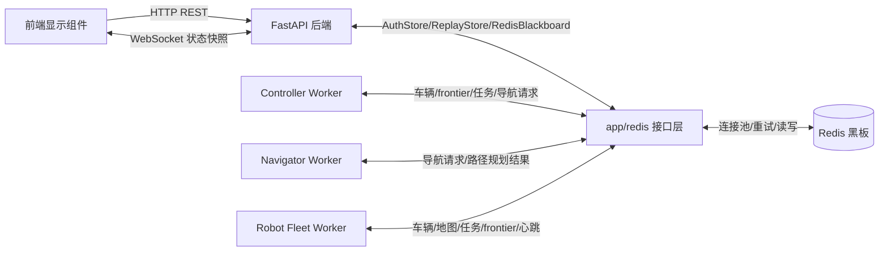
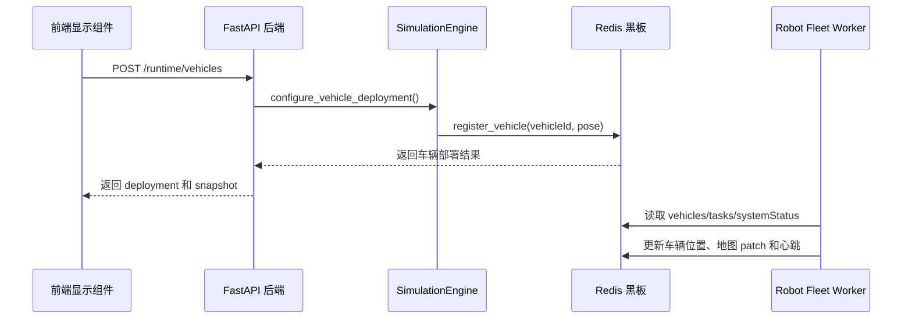
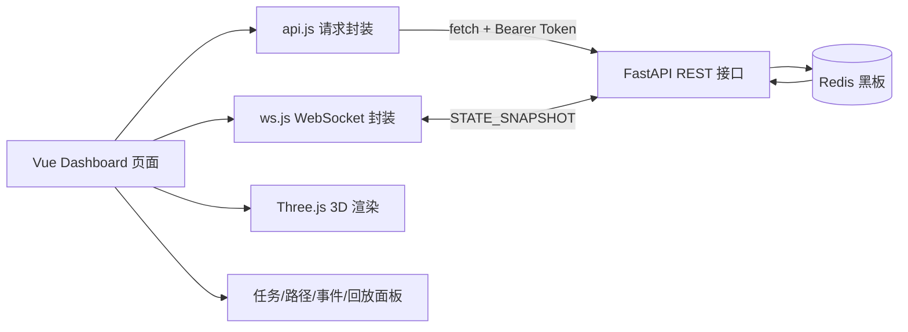
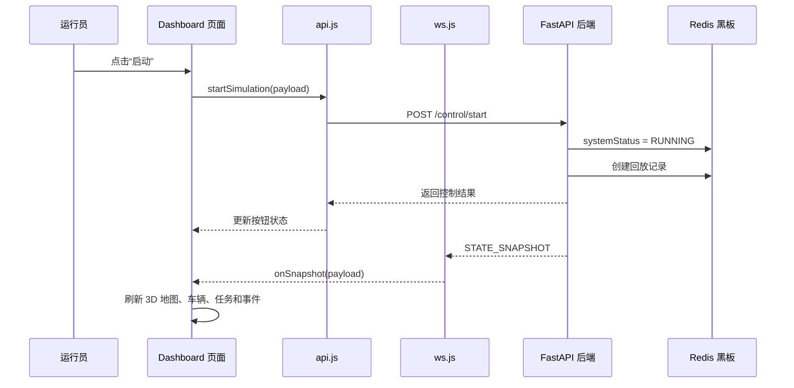

# 3.5 接口设计

本系统采用前后端分离和 Redis 黑板架构。前端显示组件通过 HTTP REST 接口和 WebSocket 接口访问 FastAPI 后端；后端、Controller Worker、Navigator Worker、Robot Fleet Worker 等组件之间不直接调用彼此方法，而是通过 Redis 黑板交换地图、小车、任务、导航请求、路径规划结果、心跳和事件等数据。

## 1）软件接口

软件接口主要包括前端与后端之间的接口，以及后端组件与 Redis 黑板之间的接口。系统中的 Controller、Navigator、Robot 等分布式组件不对外暴露独立 HTTP 服务，它们通过 Redis 黑板完成数据交换。

| 组件 | 主要职责 | 接口方式 | 说明 |
| --- | --- | --- | --- |
| 前端显示组件 | 登录、地图配置、小车配置、仿真控制、3D 展示、回放查看 | HTTP REST、WebSocket | 只访问 FastAPI 后端，不直接访问 Redis |
| FastAPI 后端 | 权限校验、接口转发、运行控制、状态快照、回放管理、静态页面服务 | HTTP REST、WebSocket、Redis 仓储接口 | 对前端提供接口，对内部通过 `app/redis` 读写 Redis 黑板 |
| Redis 接口层 | 统一管理配置、连接池、断线重试和业务数据保存 | `RedisConfig`、`RedisClientFactory`、仓储类 | 屏蔽底层 Redis 连接细节，向后端和 Worker 提供稳定的数据访问接口 |
| Redis 黑板 | 保存共享状态、任务、路径、心跳、事件和回放 | Redis Hash、String、List、Stream | 各分布式组件共享的数据中心 |
| Controller Worker | 任务分配，生成导航请求 | Redis 黑板接口 | 读取车辆、frontier 和任务，写入任务与导航请求 |
| Navigator Worker | 路径规划 | Redis 黑板接口 | 领取导航请求，写入路径规划结果 |
| Robot Fleet Worker | 小车执行、扫描、地图更新、frontier 发现 | Redis 黑板接口 | 读取任务和路径，写入车辆状态、地图 patch、frontier |

组件之间的软件接口关系如下：

```text
前端显示组件 -> FastAPI 后端 -> Redis 黑板
Controller Worker -> Redis 黑板
Navigator Worker  -> Redis 黑板
Robot Fleet Worker -> Redis 黑板
```

在分布式部署时，FastAPI 和 Redis 可以部署在中心计算机上，Controller、Navigator 和 Robot Fleet Worker 可以部署在另一台计算机上。各组件只需要配置同一个 `REDIS_URL` 和 `REDIS_PREFIX`，即可接入同一套黑板数据。

Redis 相关代码统一放在 `backend/app/redis/` 包中。该包按照配置层、客户端工具层和仓储层组织：`config.py` 负责 Redis 地址、命名空间、连接池和超时重试参数；`client.py` 负责连接池创建、连接健康检查和短暂断线重试；`base.py` 保存黑板基础业务方法；`blackboard.py`、`auth_store.py`、`replay_store.py` 分别负责 Redis 版仿真黑板、用户会话和回放数据的保存。

### 1.1 控制器

Controller Worker 负责“任务分配”：它从 Redis 黑板读取地图、车辆、frontier 和任务状态，调用内部策略生成 `AssignmentDecision`，再写入任务和导航请求。控制器本身不直接规划路径，也不直接移动小车。

普通任务优先级默认是 5；如果任务因为阻塞等原因需要重规划，Controller 会把优先级提高到 8

| 内部接口 | 输入 | 输出 | 用途 |
| --- | --- | --- | --- |
| `AssignmentPolicy.select_assignments()`(base) | 黑板快照 `snapshot`、空闲车辆 `vehicles`、OPEN 前沿点 `frontiers`、扫描半径 `scan_radius` | `AssignmentDecision` 列表 | 生成“车辆 -> frontier”的分配决策 |
| `create_task_for_frontier(vehicleId, frontier)`(blackboard) | 车辆编号、目标 frontier | `task` | 创建巡检任务，并把 frontier 标记为 `ASSIGNED` |
| `create_navigation_request(task, priority)`(blackboard) | 巡检任务、优先级 | `navigationRequest` | 为任务创建路径规划请求，交给 Navigator Worker |

#### 1.1.1 最近可达前沿策略 `NearestReachableFrontierPolicy`

接口：(base)`select_assignments(snapshot, vehicles, frontiers, scan_radius)` 读取空闲车辆和 `OPEN` frontier，输出若干个 (base)`AssignmentDecision(vehicle_id, frontier_id, score, priority)`。Controller 根据这些决策调用(blackboard) `create_task_for_frontier()` 和 `create_navigation_request()`。

算法公式：设空闲车当前位置为 $s_v$，候选前沿点集合为 $F_{open}$，某个 frontier 的坐标为 $p_f$。frontier 的未知收益为：

$$
U(p_f)=\sum_{x=p_x-r}^{p_x+r}\sum_{y=p_y-r}^{p_y+r} I(state(x,y)=UNKNOWN)
$$

其中 $r$ 是 `scan_radius`。如果 $U(p_f) \le 0$，说明这个 frontier 周围没有未知格子，直接跳过。从车辆到 frontier 的真实路径距离为：

$$
D(s_v,p_f)=\min_{\pi:s_v\rightarrow p_f}\sum_{c \in \pi} cost(c)
$$

不可走格子不参与路径：

$$
state(c)\in \{OBSTACLE, RESERVED\} \Rightarrow c \text{ 不可通行}
$$

代码中的格子代价为：

$$
cost(c)=
\begin{cases}
3.0, & state(c)=UNKNOWN\\
0.8, & state(c)=VISITED\\
1.0, & \text{其他可通行格子，如 FREE}
\end{cases}
$$

因此，对车辆 $v$ 而言，有效候选集合为：

$$
C_v=\{f\in F_{open}\mid p_f\notin Occupied,\ U(p_f)>0,\ D(s_v,p_f)<\infty\}
$$

最终选择：

$$
f^*=\arg\min_{f\in C_v}\left(D(s_v,p_f),\ M(s_v,p_f)\right)
$$

其中 $M$ 是曼哈顿距离：

$$
M(s_v,p_f)=|s_x-p_x|+|s_y-p_y|
$$

这里 $D$ 是主要排序标准，$M$ 只是当真实路径距离相同时的次级排序。

Redis 存放方式：

| 数据 | Redis Key | 读写方式 | 主要字段 |
| --- | --- | --- | --- |
| 车辆状态 | `inspection:vehicles` | 读取空闲车辆，写入 `currentTaskId` | `vehicleId`、`pose.position`、`status`、`currentTaskId` |
| 前沿点 | `inspection:frontiers` | 读取 `OPEN`，分配后写为 `ASSIGNED` | `frontierId`、`position`、`unknownGain`、`status` |
| 地图 | `inspection:map:meta`、`inspection:map:chunks` | 读取格子状态用于收益和可达性判断 | `x`、`y`、`state`、`confidence` |
| 任务 | `inspection:tasks` | 写入新任务 | `taskId`、`vehicleId`、`target`、`frontierId`、`status=PENDING` |
| 导航请求 | `inspection:navigation_requests` | 写入待规划请求 | `requestId`、`vehicleId`、`taskId`、`start`、`goal`、`status=PENDING` |

#### 1.1.2 贪心前沿策略 `GreedyFrontierPolicy`

接口：`select_assignments(snapshot, vehicles, frontiers, scan_radius)` 与最近可达策略相同，但 greedy 不计算真实路径可达性，而是直接根据未知收益和曼哈顿距离给 frontier 打分。

算法公式：

$$
score(v,f)=w_g \cdot U(p_f)-w_d \cdot M(s_v,p_f)
$$

其中，$v$ 表示当前空闲车辆，$f$ 表示候选 frontier，$s_v$ 表示车辆当前位置，$p_f$ 表示 frontier 位置，$U(p_f)$ 表示 frontier 周围的未知区域收益，$M(s_v,p_f)$ 表示车辆到 frontier 的曼哈顿距离。代码中默认 $w_g=10.0$，$w_d=0.35$。

未知收益定义为：

$$
U(p_f)=\sum_{x=p_x-r}^{p_x+r}\sum_{y=p_y-r}^{p_y+r} I(state(x,y)=UNKNOWN)
$$

曼哈顿距离为：

$$
M(s_v,p_f)=|s_x-p_x|+|s_y-p_y|
$$

完整选择公式为：

$$
f^*=\arg\max_{f\in F_{open},\ U(p_f)>0}
\left(10.0 \cdot U(p_f)-0.35 \cdot M(s_v,p_f)\right)
$$

Redis 存放方式：greedy 与 nearest 使用同一组黑板对象，区别在于 greedy 不读取真实路径距离结果，也不会把内部 `score` 写入 Redis。最终仍然写入 `inspection:tasks` 和 `inspection:navigation_requests`，并把被选中的 frontier 在 `inspection:frontiers` 中标记为 `ASSIGNED`。

#### 1.1.3 空分配策略 `NoopAssignmentPolicy`

接口：`select_assignments(snapshot, vehicles, frontiers, scan_radius)` 永远返回空列表。

算法公式：

$$
select\_assignments(\cdot)=\varnothing
$$

当运行策略为 `low_mdp` 时，控制器使用该策略。此时小车直接用低层 MDP 自主选择下一步，不再由控制器分配 frontier，也不再生成导航请求。

Redis 存放方式：`NoopAssignmentPolicy` 只读取运行配置 `inspection:runtime.policy=low_mdp`，不写入 `inspection:tasks`、`inspection:navigation_requests` 和 `inspection:frontiers` 的分配状态。

### 1.2 导航器

Navigator Worker 负责“路径规划”：它从 Redis 黑板领取 `PENDING` 导航请求，调用路径规划器得到路径，然后写回导航计划。成功计划会同步写入任务的 `pathQueue`，供小车执行。

导航器这一层的接口可以分成两类：第一类是 `Blackboard` 的读写接口，负责领取请求和写回计划；第二类是具体规划算法接口，真正计算路径。

| 层次 | 接口或方法 | 所在文件 | 输入 | 输出 | 用途 |
| --- | --- | --- | --- | --- | --- |
| 黑板接口 | `claim_navigation_request(navigatorId)` | `blackboard.py` / `redis/blackboard.py` | 导航器编号 | 单个导航请求 | 普通规划模式下领取一个 `PENDING` 请求，并标记为 `PLANNING` |
| 黑板接口 | `claim_navigation_requests(navigatorId)` | `blackboard.py` / `redis/blackboard.py` | 导航器编号 | 导航请求批次 | CBS 模式下一次领取多个 `PENDING` 请求 |
| 规划器选择 | `create_planner(config, request)` | `navigator/planners/factory.py` | 运行配置、导航请求 | `AStarPlanner` 或 `StAStarPlanner` | 普通模式下选择具体单请求规划器 |
| 规划器协议 | `PlannerProtocol.plan(snapshot, request)` | `navigator/planners/base.py` | 黑板快照、导航请求 | `(path, failReason)` | 单请求规划器的统一接口 |
| A* 实现 | `AStarPlanner.plan()` / `astar()` | `navigator/planners/astar_planner.py` | 地图、起点、终点 | 路径或失败原因 | 不考虑时间预约的单车网格路径规划 |
| 时空 A* 实现 | `StAStarPlanner.plan()` / `st_astar()` | `navigator/planners/st_astar_planner.py` | 地图、起点、终点、预约表 | 路径或失败原因 | 在时间维度上避让已有车辆路径 |
| CBS 实现 | `CBSPlanner.plan_batch(snapshot, requests)` | `navigator/planners/cbs_planner.py` | 黑板快照、导航请求批次 | 每个请求对应的路径或失败原因 | 多车联合规划，检测冲突并加约束重规划 |
| 黑板接口 | `write_navigation_plan(plan)` | `blackboard.py` / `redis/blackboard.py` | 路径计划 | 保存后的 `navigationPlan` | 写回规划结果，并更新 `navigation_requests` 和 `tasks` |

普通模式的数据流为：

```text
claim_navigation_request()
  -> create_planner()
  -> AStarPlanner.plan() 或 StAStarPlanner.plan()
  -> write_navigation_plan()
```

CBS 模式的数据流为：

```text
claim_navigation_requests()
  -> CBSPlanner.plan_batch()
  -> write_navigation_plan()
```

#### 1.2.1 单车 A* 路径规划 `AStarPlanner`

接口：`AStarPlanner.plan(snapshot, request)` 实现统一的 `PlannerProtocol.plan()`，读取 `request.start`、`request.goal` 和 `snapshot.map`，内部调用 `astar(map_grid, start, goal)`，输出路径 `path` 或失败原因 `failReason`。

算法公式：A* 的搜索状态为二维网格点 $n=(x,y)$，评价函数为：

$$
f(n)=g(n)+h(n)
$$

其中 $g(n)$ 是从起点到当前点的累计路径代价，启发函数使用曼哈顿距离：

$$
h(n)=|x-x_g|+|y-y_g|
$$

累计路径代价为：

$$
g(n)=\sum_{c\in \pi_{s\rightarrow n}} cost(c)
$$

格子代价与 nearest 策略一致：

$$
cost(c)=
\begin{cases}
3.0, & state(c)=UNKNOWN\\
0.8, & state(c)=VISITED\\
1.0, & state(c)=FREE\\
\infty, & state(c)\in\{OBSTACLE, RESERVED\}
\end{cases}
$$

Redis 存放方式：

| 数据 | Redis Key | 读写方式 | 主要字段 |
| --- | --- | --- | --- |
| 导航请求 | `inspection:navigation_requests` | 领取后 `PENDING -> PLANNING`，完成后 `SUCCESS/FAILED` | `requestId`、`taskId`、`vehicleId`、`start`、`goal`、`assignedNavigatorId` |
| 地图 | `inspection:map:meta`、`inspection:map:chunks` | 读取格子状态用于规划 | `width`、`height`、`cells`、`version` |
| 导航计划 | `inspection:navigation_plans` | 写入规划结果 | `planId`、`requestId`、`path`、`planner=astar`、`status` |
| 任务 | `inspection:tasks` | 成功时写入 `pathQueue` 并改为 `PLANNED` | `taskId`、`planId`、`pathQueue`、`currentStepIndex` |

#### 1.2.2 时空 A* 路径规划 `StAStarPlanner`

接口：`StAStarPlanner.plan(snapshot, request)` 也实现统一的 `PlannerProtocol.plan()`。当请求 `avoidVehicles=True` 且配置 `use_st_astar=True` 时，普通导航模式会通过 `create_planner()` 选择该规划器。它会先根据其他任务路径构造时间预约表，再调用 `st_astar()` 规划路径。

算法公式：时空 A* 的搜索状态为：

$$
q=(x,y,t)
$$

评价函数为：

$$
f(q)=g(q)+h(x,y)
$$

每次扩展四邻域和原地等待：

$$
(x',y')\in N_4(x,y)\cup\{(x,y)\},\quad t'=t+1
$$

若 $R_t$ 表示时间片 $t$ 已被占用的格子集合，$E_t$ 表示时间片 $t$ 已被占用的边集合，则合法后继需要满足：

$$
(x',y')\notin R_{t'} \quad \land \quad ((x',y'),(x,y),t')\notin E
$$

其中第二个条件用于避免两辆车对向交换位置。原地等待动作的代价为 $1.0$，移动到不同状态格子的代价仍按地图状态计算。

Redis 存放方式：时空 A* 除了读取 `inspection:navigation_requests` 和地图外，还会读取 `inspection:tasks` 中其他未完成任务的 `pathQueue/currentStepIndex`，以及 `inspection:vehicles` 中空闲车辆的位置，构造时间预约表。写回的 `inspection:navigation_plans.path` 中每一步包含 `stepIndex`、`position`、`heading`、`expectedTimeSlot` 和 `action`，其中 `action` 可以是 `MOVE` 或 `WAIT`。

#### 1.2.3 CBS 多车冲突搜索 `CBSPlanner`

接口：`CBSPlanner.plan_batch(snapshot, requests)` 一次处理多个导航请求。Navigator Worker 在 `navigatorAlgorithm=cbs` 时调用 `claim_navigation_requests()` 批量领取请求，再把请求列表传给 CBS。CBS 内部的低层搜索仍然调用 `st_astar()`，但会额外加入冲突约束。

算法公式：CBS 的目标是最小化多车路径总代价：

$$
Cost(\Pi)=\sum_i (|\pi_i|-1)
$$

CBS 高层维护约束集合 $\Omega$，低层在约束下调用时空 A*：

$$
\pi_i=\operatorname{ST\_A^*}(s_i,g_i,\Omega_i)
$$

CBS 检测两类冲突。顶点冲突表示两车同一时刻占用同一格：

$$
\exists i\ne j,\ \pi_i(t)=\pi_j(t)
$$

边冲突表示两车同一时间片对向交换位置：

$$
\pi_i(t-1)=\pi_j(t)\ \land\ \pi_i(t)=\pi_j(t-1)
$$

发现冲突后，CBS 分别给冲突车辆添加顶点约束或边约束，生成子节点，并按 `solution_cost` 从小到大继续搜索，直到无冲突或达到 `cbs_max_nodes` 上限。

Redis 存放方式：CBS 批量读取 `inspection:navigation_requests` 中多个 `PENDING` 请求，将它们标记为 `PLANNING` 并写入同一个 `assignedNavigatorId`。它读取 `inspection:tasks` 和 `inspection:vehicles` 构造不属于本批次的固定预约，最后为每个请求分别写入一条 `inspection:navigation_plans` 记录；成功时对应任务进入 `PLANNED`，失败时对应请求和计划记录失败原因。

### 1.3 小车

Robot Fleet Worker 负责“执行与感知”：它读取任务和路径，更新车辆状态，扫描真实环境，上传地图 patch，并发现新的 frontier。若启用 `low_mdp`，小车不再等待控制器和导航器，而是自己做局部决策。

| 内部接口 | 输入 | 输出 | 用途 |
| --- | --- | --- | --- |
| `run_vehicle_once(vehicleId)` | 车辆编号、当前任务、路径 | 移动步数 | 执行任务路径中的下一步 |
| `scan_and_upload(vehicleId)` | 车辆编号、当前位置 | 地图 patch | 扫描周围环境并上传地图更新 |
| `detect_frontiers(vehicleId, center, radius)` | 车辆编号、中心点、搜索半径 | frontier 写入结果 | 在已知区域边界发现候选 frontier |
| `LowLevelMDPAlgorithm.choose_step(...)` | 车辆、地图快照、已选下一位置和边 | 下一格坐标 | low_mdp 模式下直接选择下一步 |

#### 1.3.1 路径执行算法 `RobotComponent.run_vehicle_once`

接口：`run_vehicle_once(vehicleId)` 读取车辆当前任务。如果任务已有 `pathQueue`，小车执行 `currentStepIndex + 1` 对应的下一步；如果没有任务或任务还未规划，则先扫描环境。

算法公式：设任务路径为：

$$
\pi=[p_0,p_1,\dots,p_k]
$$

当前执行下标为 $i$，则下一步为：

$$
p_{next}=p_{i+1}
$$

若下一步是真实障碍，则触发阻塞上报：

$$
blocked(p_{next}) \Rightarrow status(task)=PENDING,\ pathQueue=\varnothing,\ replanCount=replanCount+1
$$

若下一步可通行，则更新车辆状态：

$$
pose_v \leftarrow p_{next},\quad currentStepIndex \leftarrow i+1,\quad battery \leftarrow battery-1
$$

Redis 存放方式：小车读取 `inspection:tasks` 中自己的当前任务和 `pathQueue`，读取 `inspection:vehicles` 中自己的位置状态；移动后写回 `inspection:vehicles.pose/status/currentStepIndex/currentTaskId/currentPlanId`，同时更新 `inspection:tasks.currentStepIndex/status`。任务完成时写入 `status=DONE`，并把对应 `inspection:frontiers.status` 改为 `VISITED`；遇到阻塞时写入事件 `VEHICLE_BLOCKED`，并等待 Controller 重新创建导航请求。

#### 1.3.2 扫描与地图上传算法 `FrontierScanAlgorithm.scan_and_upload`

接口：`scan_and_upload(vehicleId, detect_frontiers)` 读取车辆当前位置，以 `scan_radius` 为半径扫描局部区域，生成地图 patch 并调用 `upload_map_patch()` 写回黑板。

算法公式：设车辆当前位置为 $s_v=(s_x,s_y)$，扫描区域为：

$$
S_v=\{(x,y)\mid s_x-r\le x\le s_x+r,\ s_y-r\le y\le s_y+r\}
$$

每个可见格子的状态更新规则为：

$$
state'(x,y)=
\begin{cases}
OBSTACLE, & truth(x,y)=blocked\\
VISITED, & (x,y)=s_v\\
FREE, & \text{其他可见格子}
\end{cases}
$$

Redis 存放方式：扫描结果以 patch 形式上传，包含 `patchId`、`vehicleId`、`baseMapVersion`、`cells`、`timestamp`。黑板合并后更新 `inspection:map:meta.version/updatedAt` 和 `inspection:map:chunks` 中的格子状态；若格子状态变化，还会写入 `inspection:events` 中的 `MAP_UPDATED` 事件。

#### 1.3.3 Frontier 检测算法 `FrontierScanAlgorithm.detect_frontiers`

接口：`detect_frontiers(vehicleId, center, radius)` 在车辆附近搜索 frontier，并调用 `save_frontier()` 写入黑板。

算法公式：frontier 必须位于已知可通行区域，且八邻域存在未知格子：

$$
state(p_f)\in \{FREE,VISITED\}
\quad \land \quad
\exists q\in N_8(p_f),\ state(q)=UNKNOWN
$$

frontier 的未知收益为：

$$
U(p_f)=\sum_{x=p_x-r}^{p_x+r}\sum_{y=p_y-r}^{p_y+r} I(state(x,y)=UNKNOWN)
$$

本次扫描内部的排序分数为：

$$
rank(p_f)=10.0\cdot U(p_f)-0.15\cdot M(center,p_f)
$$

小车按 `(rank, unknownGain)` 降序保留最多 `MAX_FRONTIERS_PER_SCAN=16` 个候选点。

Redis 存放方式：frontier 写入 `inspection:frontiers`，主要字段包括 `frontierId`、`position`、`unknownGain`、`discoveredBy`、`status=OPEN`、`timestamp`。同一位置的 `OPEN/ASSIGNED` frontier 会去重，不重复生成记录；地图更新后，过期 frontier 会被刷新为 `CLOSED` 或 `VISITED`。

#### 1.3.4 低层 MDP 自主探索 `LowLevelMDPAlgorithm`

接口：当 `inspection:runtime.policy=low_mdp` 时，Robot Fleet Worker 调用 `LowLevelMDPAlgorithm.run_once()`。每辆车通过 `choose_step(vehicle, snapshot, selected_next, selected_edges)` 直接选择下一格。

算法公式：先在车辆当前位置附近构造局部已知可通行状态集合：

$$
S=\{s\mid dist(s,s_v)\le H,\ state(s)\in\{FREE,VISITED\}\}
$$

奖励为该状态扫描半径内可见未知格子数量：

$$
R(s)=U(s)
$$

为了减少多车扎堆，对靠近其他车辆或本轮已被其他车辆选中位置的状态加入斥力惩罚：

$$
P(s)=\sum_{o\in O} w_o\cdot \gamma^{M(s,o)}
$$

价值迭代更新公式为：

$$
V_{k+1}(s)=R(s)-P(s)+\gamma\max_{s'\in N_4(s)\cup\{s\}}\left(V_k(s')-c_{move}\right)
$$

最终只在当前位置四邻域和原地等待中选下一步：

$$
a^*=\arg\max_{a\in N_4(s_v)\cup\{s_v\}}
\left(R(a)-P(a)+\gamma V(a)-movePenalty(a)\right)
$$

默认参数包括 `low_level_mdp_horizon=20`、`low_level_mdp_discount=0.80`、`low_level_mdp_iterations=50`、`low_level_mdp_repulsion_weight=8.0`、`low_level_mdp_move_cost=0.2`。

Redis 存放方式：low_mdp 模式主要读取 `inspection:runtime.policy`、`inspection:vehicles` 和地图数据，不依赖 `inspection:tasks`、`inspection:navigation_requests`、`inspection:navigation_plans`。每轮直接写回 `inspection:vehicles.pose/status/battery`，并通过扫描继续更新 `inspection:map:meta`、`inspection:map:chunks` 和 `inspection:heartbeats`。该模式默认不需要 Controller 分配 frontier，也不需要 Navigator 规划全局路径。

## 2）分布式数据接口

项目中的分布式数据接口为 Redis 黑板接口。后端通过 `app/redis` 包封装 Redis 配置、连接池、断线重试和业务数据读写，各组件通过仓储方法进行数据操作，不直接依赖其他组件的进程地址，也不在业务代码中重复创建 Redis 连接。

### 2.1 Redis 接口

Redis 接口层的代码组织如下：

| 层次 | 所在文件 | 主要接口 | 职责 |
| --- | --- | --- | --- |
| 配置层 | `app/redis/config.py` | `RedisConfig`、`redis_config_from_env()` | 统一读取 `REDIS_URL`、`REDIS_PREFIX`、连接池大小、连接超时、读写超时和重试参数 |
| 客户端工具层 | `app/redis/client.py` | `RedisClientFactory`、`ResilientRedis`、`create_redis_client()` | 创建 Redis 连接池，执行 `ping` 健康检查，并在短暂断线时自动重试 |
| 黑板基础逻辑层 | `app/redis/base.py` | `Blackboard`、`now_ms()` | 定义地图、车辆、frontier、任务、导航请求、导航计划、事件等基础业务方法 |
| Redis 仿真黑板仓储 | `app/redis/blackboard.py` | `RedisBlackboard` | 继承基础黑板逻辑，并负责把地图、车辆、任务、导航、心跳、事件和系统状态持久化到 Redis |
| 用户会话仓储 | `app/redis/auth_store.py` | `AuthStore` | 保存用户、角色、密码哈希和登录 session |
| 回放仓储 | `app/redis/replay_store.py` | `ReplayStore` | 保存仿真回放索引和压缩后的状态帧 |

| 接口类别 | 主要方法 | 数据对象 | 用途 |
| --- | --- | --- | --- |
| Redis 配置接口 | `redis_config_from_env()` | RedisConfig | 读取 Redis 连接地址、命名空间、连接池和重试配置 |
| Redis 客户端接口 | `create_redis_client()` | Redis 连接池、Redis TCP 连接 | 统一创建可复用 Redis 客户端，避免频繁建立和销毁连接 |
| 系统状态接口 | `set_system_status()`、`snapshot()`、`snapshot_since()` | system、map、vehicles、tasks 等 | 设置运行状态，获取完整或增量状态快照 |
| 小车状态接口 | `register_vehicle()`、`update_vehicle_state()` | vehicles、heartbeats | 注册小车，更新小车位置、状态和心跳 |
| 地图感知接口 | `upload_map_patch()`、`configure_map()`、`configure_obstacles()` | map、map:chunks | 上传扫描结果，配置地图和障碍物 |
| 前沿点接口 | `save_frontier()`、`open_frontiers()` | frontiers | 保存和读取 frontier 前沿点 |
| 任务接口 | `create_task_for_frontier()`、`get_vehicle_task()`、`mark_task_done()` | tasks | 创建、查询、推进和完成巡检任务 |
| 导航请求接口 | `create_navigation_request()`、`claim_navigation_request()` | navigation_requests | 创建和领取路径规划请求 |
| 路径规划接口 | `write_navigation_plan()` | navigation_plans | 写入路径规划成功或失败结果 |
| 心跳接口 | `update_heartbeat()` | heartbeats | 上报 Controller、Navigator、Robot 组件状态 |
| 事件接口 | `add_event()` | events | 记录系统控制、任务分配、路径规划、阻塞等事件 |
| 用户认证接口 | `AuthStore.login()`、`get_session()`、`logout()` | auth:users、auth:session | 管理用户账号、角色权限和登录会话 |
| 回放接口 | `ReplayStore.start()`、`record()`、`finish()` | replays:index、replays:frames | 保存仿真回放索引和状态帧 |

主要 Redis 数据结构如下：

| Redis Key | Redis 类型 | 说明 |
| --- | --- | --- |
| `inspection:system` | Hash | 系统运行状态 |
| `inspection:runtime` | Hash | 策略、导航算法、导航器数量等运行配置 |
| `inspection:counters` | Hash | event、task、frontier、request、plan 等编号计数器 |
| `inspection:map:meta` | Hash | 地图元数据 |
| `inspection:map:chunks` | Hash | 地图分块数据 |
| `inspection:map:deltas` | List | 地图增量更新记录 |
| `inspection:vehicles` | Hash | 小车状态 |
| `inspection:frontiers` | Hash | 前沿点数据 |
| `inspection:tasks` | Hash | 巡检任务 |
| `inspection:navigation_requests` | Hash | 导航请求 |
| `inspection:navigation_plans` | Hash | 路径规划结果 |
| `inspection:heartbeats` | Hash | 组件心跳 |
| `inspection:events` | Stream | 系统事件日志 |
| `inspection:lock` | String | RedisBlackboard 批量读写时使用的互斥锁 |
| `inspection:locks:controller` | String | Controller Worker 单例锁，避免多个控制器重复分配任务 |
| `inspection:auth:users` | Hash | 用户账号和权限 |
| `inspection:auth:session:{token}` | String | 用户登录会话 |
| `inspection:replays:index` | Hash | 回放索引 |
| `inspection:replays:frames:{replayId}` | List | 回放帧 |

### 图 3-8 数据接口图



### 2.2 与小车有关的接口

#### （1）小车运行数据接口

小车运行数据接口用于 Robot Fleet Worker 和 Redis 黑板之间的数据交互。Robot Fleet Worker 周期性读取系统状态、车辆状态、任务和路径计划，并将车辆移动、扫描结果和心跳写回 Redis。

| 接口方法 | 输入 | 输出 | 用途 |
| --- | --- | --- | --- |
| `register_vehicle(vehicleId, pose)` | 小车编号、初始位姿 | 小车信息 | 初始化小车状态 |
| `update_vehicle_state(payload)` | 小车编号、位置、状态、任务编号 | 更新后小车信息 | 写入小车当前位置和运行状态 |
| `get_vehicle_task(vehicleId)` | 小车编号 | 当前任务 | 获取小车当前任务 |
| `upload_map_patch(patch)` | 小车扫描到的地图 patch | 地图更新结果 | 写入可通行、已访问或障碍格子 |
| `save_frontier(frontier)` | 前沿点坐标和评分 | 前沿点信息 | 保存新发现的 frontier |
| `update_heartbeat(componentId, type, status, workId)` | 组件编号、类型、状态 | 心跳信息 | 上报小车或组件运行状态 |

#### （2）小车初始接口

小车初始化由界面触发，后端负责将小车部署信息写入 Redis 黑板。当前项目中，小车初始化主要对应两个接口层级：

| 层级 | 接口 | 方法 | 用途 |
| --- | --- | --- | --- |
| 前端配置接口 | `/runtime/vehicles` | POST | 由运行员在界面设置小车数量、部署方式和初始位置 |
| 内部注册接口 | `/robot/register` | POST | 将单辆小车编号和位姿写入 Redis 黑板 |

`/runtime/vehicles` 示例请求：

```json
{
  "count": 3,
  "mode": "manual",
  "positions": [
    {"x": 2, "y": 2},
    {"x": 4, "y": 2},
    {"x": 6, "y": 2}
  ]
}
```

`/robot/register` 示例请求：

```json
{
  "vehicleId": "car-01",
  "pose": {
    "position": {"x": 2, "y": 2},
    "heading": 0
  }
}
```

### 图 3-9 小车初始接口图



## 3）通讯接口

系统当前没有单独实现自定义加密通信协议。组件通信方式主要包括 HTTP、WebSocket 和 Redis TCP 连接。

| 通讯对象 | 通讯方式 | 当前实现 | 说明 |
| --- | --- | --- | --- |
| 前端 -> FastAPI | HTTP REST | Bearer Token | 登录后前端在请求头中携带 token |
| 前端 <-> FastAPI | WebSocket | URL token 参数 | 建立 `/ws?token=...` 连接后接收状态快照 |
| FastAPI -> Redis | Redis TCP | `REDIS_URL` 配置 | 读写用户、配置、状态、回放等数据 |
| Worker -> Redis | Redis TCP | `REDIS_URL` 配置 | Controller、Navigator、Robot 读写黑板数据 |
| 浏览器静态资源 | HTTP | FastAPI 静态文件服务 | 用于访问 Dashboard 和前端打包文件 |

通信安全方面，系统通过登录 token 区分用户身份和角色。管理员、运行员、分析员只能访问各自权限范围内的接口。Redis 建议部署在本机、局域网或 Docker 内部网络中，不直接暴露公网端口。

## 4）界面接口

界面接口主要由前端 `api.js` 和 `ws.js` 封装。前端组件不直接操作 Redis，而是通过 FastAPI 提供的 REST 和 WebSocket 接口访问系统数据。

### 4.1 REST 接口

| 接口类别 | 接口路径 | 方法 | 前端封装函数 | 用途 |
| --- | --- | --- | --- | --- |
| 登录接口 | `/auth/login` | POST | `login()` | 用户登录，返回 token 和用户信息 |
| 当前用户接口 | `/auth/me` | GET | `fetchCurrentUser()` | 获取当前登录用户 |
| 退出接口 | `/auth/logout` | POST | `logout()` | 删除当前会话 |
| 状态接口 | `/state` | GET | `fetchState()` | 获取系统完整状态或地图增量状态 |
| 运行参数接口 | `/runtime` | GET | `fetchRuntime()` | 获取策略、算法、导航器数量等配置 |
| 启动接口 | `/control/start` | POST | `startSimulation()` | 启动仿真 |
| 暂停接口 | `/control/pause` | POST | `pauseSimulation()` | 暂停仿真 |
| 继续接口 | `/control/resume` | POST | `resumeSimulation()` | 继续仿真 |
| 停止接口 | `/control/stop` | POST | `stopSimulation()` | 停止仿真并结束回放 |
| 重置接口 | `/control/reset` | POST | `resetSimulation()` | 重置运行状态 |
| 策略配置接口 | `/runtime/policy` | POST | `setPolicy()` | 设置任务分配策略 |
| 导航算法接口 | `/runtime/navigator` | POST | `setNavigatorAlgorithm()` | 设置路径规划算法 |
| 导航器数量接口 | `/runtime/navigators` | POST | `setNavigatorCount()` | 设置导航器数量 |
| 小车配置接口 | `/runtime/vehicles` | POST | `setVehicles()` | 配置小车数量和初始位置 |
| 地图配置接口 | `/runtime/map` | POST | `setMap()` | 配置地图大小和分块 |
| 障碍配置接口 | `/runtime/obstacles` | POST | `setObstacles()` | 批量配置障碍物 |
| 单格障碍接口 | `/runtime/obstacles/cell` | POST | `setObstacleCell()` | 修改单个地图格子的障碍状态 |
| 多格障碍接口 | `/runtime/obstacles/cells` | POST | `setObstacleCells()` | 批量修改地图格子 |
| 回放列表接口 | `/replays` | GET | `fetchReplays()` | 获取历史回放列表 |
| 回放详情接口 | `/replays/{replayId}` | GET | `fetchReplay()` | 获取指定回放数据 |
| 回放删除接口 | `/replays/{replayId}` | DELETE | `deleteReplay()` | 删除指定回放 |
| 用户管理接口 | `/admin/users` | GET/POST/PUT/DELETE | `fetchUsers()` 等 | 管理运行员和分析员账号 |

### 4.2 WebSocket 接口

| 接口路径 | 消息方向 | 消息类型 | 用途 |
| --- | --- | --- | --- |
| `/ws?token={token}` | 后端 -> 前端 | `STATE_SNAPSHOT` | 推送系统状态快照、地图增量、车辆、任务、路径和事件 |
| `/ws?token={token}` | 前端 -> 后端 | `CONTROL` | 可选控制消息，如 start、pause、resume、stop、reset |

状态快照示例：

```json
{
  "type": "STATE_SNAPSHOT",
  "payload": {
    "map": {},
    "vehicles": [],
    "frontiers": [],
    "tasks": [],
    "navigationRequests": [],
    "navigationPlans": [],
    "heartbeats": [],
    "events": [],
    "runtime": {}
  },
  "sentAt": 1710000000000
}
```

### 图 3-10 界面原理图



界面技术原理说明：

```text
前端通过 api.js 统一封装 HTTP 请求，通过 ws.js 创建 WebSocket 长连接。
运行员在界面点击启动、暂停、切换策略或配置地图时，前端调用对应 REST 接口；
后端把配置和控制状态写入 Redis 黑板。系统运行过程中，后端定时读取 Redis
黑板生成状态快照，并通过 WebSocket 推送给前端。前端收到 STATE_SNAPSHOT 后，
更新 Vue 状态，并使用 Three.js 刷新地图、小车模型、frontier、路径和状态面板。
```

### 图 3-11 调用界面图



界面调用说明：

```text
当前项目界面采用 Vue + Three.js 的浏览器界面。Three.js 负责 3D 地图和小车显示，
Vue 负责按钮、表单、任务列表、导航请求、路径计划、事件日志和回放分析等界面状态。
界面不直接访问 Redis，而是通过 FastAPI 接口获取数据和发送控制命令。
```

## 5）接口设计小结

本系统接口设计的核心思想是：外部界面通过 FastAPI 暴露的 REST 和 WebSocket 接口进行交互；内部组件通过 Redis 黑板共享状态。Controller、Navigator 和 Robot 之间不直接调用，从而降低耦合度，并支持单机运行和两机分布式部署。
