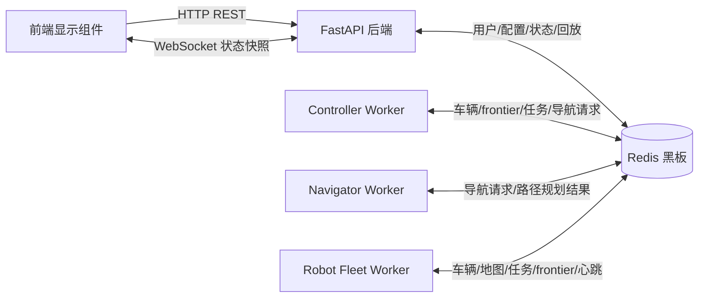
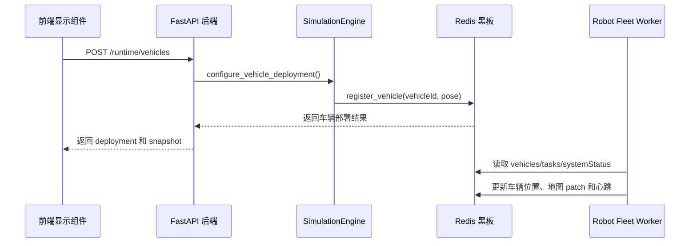
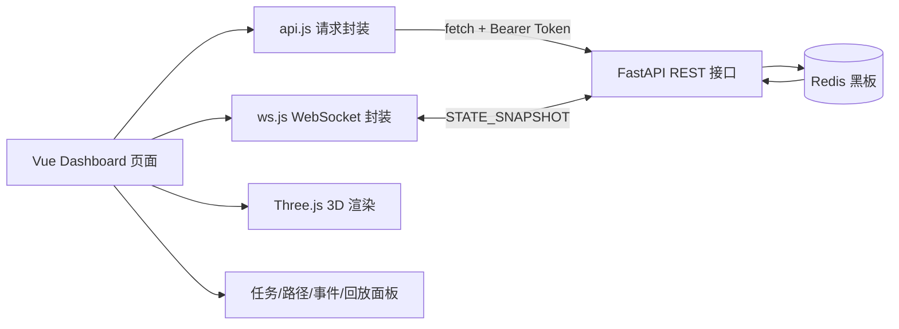
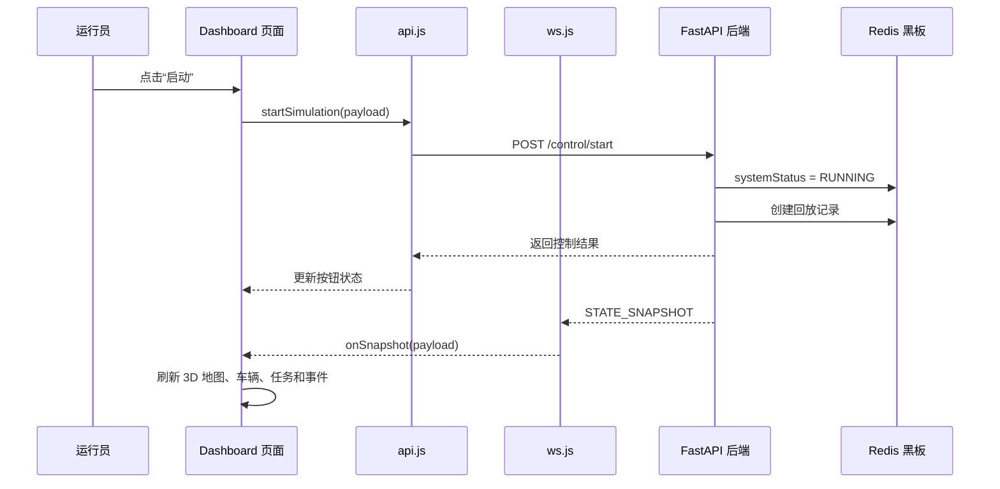

# 3.5 接口设计

本系统采用前后端分离和 Redis 黑板架构。前端显示组件通过 HTTP REST 接口和 WebSocket 接口访问 FastAPI 后端；后端、Controller Worker、Navigator Worker、Robot Fleet Worker 等组件之间不直接调用彼此方法，而是通过 Redis 黑板交换地图、小车、任务、导航请求、路径规划结果、心跳和事件等数据。

## 1）软件接口

软件接口主要包括前端与后端之间的接口，以及后端组件与 Redis 黑板之间的接口。系统中的 Controller、Navigator、Robot 等分布式组件不对外暴露独立 HTTP 服务，它们通过 Redis 黑板完成数据交换。

| 组件 | 主要职责 | 接口方式 | 说明 |
| --- | --- | --- | --- |
| 前端显示组件 | 登录、地图配置、小车配置、仿真控制、3D 展示、回放查看 | HTTP REST、WebSocket | 只访问 FastAPI 后端，不直接访问 Redis |
| FastAPI 后端 | 权限校验、接口转发、运行控制、状态快照、回放管理、静态页面服务 | HTTP REST、WebSocket、Redis 客户端 | 对前端提供接口，对内部读写 Redis 黑板 |
| Redis 黑板 | 保存共享状态、任务、路径、心跳、事件和回放 | Redis Hash、String、List、Stream | 各分布式组件共享的数据中心 |
| Controller Worker | 任务分配，生成导航请求 | Redis 黑板接口 | 读取车辆、frontier 和任务，写入任务与导航请求 |
| Navigator Worker | 路径规划 | Redis 黑板接口 | 领取导航请求，写入路径规划结果 |
| Robot Fleet Worker | 小车执行、扫描、地图更新、frontier 发现 | Redis 黑板接口 | 读取任务和路径，写入车辆状态、地图 patch、frontier |

组件之间的软件接口关系如下：

```text
前端显示组件 -> FastAPI 后端 -> Redis 黑板
Controller Worker -> Redis 黑板
Navigator Worker  -> Redis 黑板
Robot Fleet Worker -> Redis 黑板
```

在分布式部署时，FastAPI 和 Redis 可以部署在中心计算机上，Controller、Navigator 和 Robot Fleet Worker 可以部署在另一台计算机上。各组件只需要配置同一个 `REDIS_URL` 和 `REDIS_PREFIX`，即可接入同一套黑板数据。

## 2）分布式数据接口

项目中的分布式数据接口为 Redis 黑板接口。后端通过 `RedisBlackboard` 封装 Redis 读写，各组件通过黑板方法进行数据操作，不直接依赖其他组件的进程地址。

### 2.1 Redis 接口

| 接口类别 | 主要方法 | 数据对象 | 用途 |
| --- | --- | --- | --- |
| 系统状态接口 | `set_system_status()`、`snapshot()`、`snapshot_since()` | system、map、vehicles、tasks 等 | 设置运行状态，获取完整或增量状态快照 |
| 小车状态接口 | `register_vehicle()`、`update_vehicle_state()` | vehicles、heartbeats | 注册小车，更新小车位置、状态和心跳 |
| 地图感知接口 | `upload_map_patch()`、`configure_map()`、`configure_obstacles()` | map、map:chunks | 上传扫描结果，配置地图和障碍物 |
| 前沿点接口 | `save_frontier()`、`open_frontiers()` | frontiers | 保存和读取 frontier 前沿点 |
| 任务接口 | `create_task_for_frontier()`、`get_vehicle_task()`、`mark_task_done()` | tasks | 创建、查询、推进和完成巡检任务 |
| 导航请求接口 | `create_navigation_request()`、`claim_navigation_request()` | navigation_requests | 创建和领取路径规划请求 |
| 路径规划接口 | `write_navigation_plan()` | navigation_plans | 写入路径规划成功或失败结果 |
| 心跳接口 | `update_heartbeat()` | heartbeats | 上报 Controller、Navigator、Robot 组件状态 |
| 事件接口 | `add_event()` | events | 记录系统控制、任务分配、路径规划、阻塞等事件 |
| 回放接口 | `ReplayStore.start()`、`record()`、`finish()` | replays:index、replays:frames | 保存仿真回放索引和状态帧 |

主要 Redis 数据结构如下：

| Redis Key | Redis 类型 | 说明 |
| --- | --- | --- |
| `inspection:system` | Hash | 系统运行状态 |
| `inspection:runtime` | Hash | 策略、导航算法、导航器数量等运行配置 |
| `inspection:map:meta` | Hash | 地图元数据 |
| `inspection:map:chunks` | Hash | 地图分块数据 |
| `inspection:vehicles` | Hash | 小车状态 |
| `inspection:frontiers` | Hash | 前沿点数据 |
| `inspection:tasks` | Hash | 巡检任务 |
| `inspection:navigation_requests` | Hash | 导航请求 |
| `inspection:navigation_plans` | Hash | 路径规划结果 |
| `inspection:heartbeats` | Hash | 组件心跳 |
| `inspection:events` | Stream | 系统事件日志 |
| `inspection:auth:users` | Hash | 用户账号和权限 |
| `inspection:auth:session:{token}` | String | 用户登录会话 |
| `inspection:replays:index` | Hash | 回放索引 |
| `inspection:replays:frames:{replayId}` | List | 回放帧 |

### 图 3-8 数据接口图



### 2.2 与小车有关的接口

#### （1）小车运行数据接口

小车运行数据接口用于 Robot Fleet Worker 和 Redis 黑板之间的数据交互。Robot Fleet Worker 周期性读取系统状态、车辆状态、任务和路径计划，并将车辆移动、扫描结果和心跳写回 Redis。

| 接口方法 | 输入 | 输出 | 用途 |
| --- | --- | --- | --- |
| `register_vehicle(vehicleId, pose)` | 小车编号、初始位姿 | 小车信息 | 初始化小车状态 |
| `update_vehicle_state(payload)` | 小车编号、位置、状态、任务编号 | 更新后小车信息 | 写入小车当前位置和运行状态 |
| `get_vehicle_task(vehicleId)` | 小车编号 | 当前任务 | 获取小车当前任务 |
| `upload_map_patch(patch)` | 小车扫描到的地图 patch | 地图更新结果 | 写入可通行、已访问或障碍格子 |
| `save_frontier(frontier)` | 前沿点坐标和评分 | 前沿点信息 | 保存新发现的 frontier |
| `update_heartbeat(componentId, type, status, workId)` | 组件编号、类型、状态 | 心跳信息 | 上报小车或组件运行状态 |

#### （2）小车初始接口

小车初始化由界面触发，后端负责将小车部署信息写入 Redis 黑板。当前项目中，小车初始化主要对应两个接口层级：

| 层级 | 接口 | 方法 | 用途 |
| --- | --- | --- | --- |
| 前端配置接口 | `/runtime/vehicles` | POST | 由运行员在界面设置小车数量、部署方式和初始位置 |
| 内部注册接口 | `/robot/register` | POST | 将单辆小车编号和位姿写入 Redis 黑板 |

`/runtime/vehicles` 示例请求：

```json
{
  "count": 3,
  "mode": "manual",
  "positions": [
    {"x": 2, "y": 2},
    {"x": 4, "y": 2},
    {"x": 6, "y": 2}
  ]
}
```

`/robot/register` 示例请求：

```json
{
  "vehicleId": "car-01",
  "pose": {
    "position": {"x": 2, "y": 2},
    "heading": 0
  }
}
```

### 图 3-9 小车初始接口图



## 3）通讯接口

系统当前没有单独实现自定义加密通信协议。组件通信方式主要包括 HTTP、WebSocket 和 Redis TCP 连接。

| 通讯对象 | 通讯方式 | 当前实现 | 说明 |
| --- | --- | --- | --- |
| 前端 -> FastAPI | HTTP REST | Bearer Token | 登录后前端在请求头中携带 token |
| 前端 <-> FastAPI | WebSocket | URL token 参数 | 建立 `/ws?token=...` 连接后接收状态快照 |
| FastAPI -> Redis | Redis TCP | `REDIS_URL` 配置 | 读写用户、配置、状态、回放等数据 |
| Worker -> Redis | Redis TCP | `REDIS_URL` 配置 | Controller、Navigator、Robot 读写黑板数据 |
| 浏览器静态资源 | HTTP | FastAPI 静态文件服务 | 用于访问 Dashboard 和前端打包文件 |

通信安全方面，系统通过登录 token 区分用户身份和角色。管理员、运行员、分析员只能访问各自权限范围内的接口。Redis 建议部署在本机、局域网或 Docker 内部网络中，不直接暴露公网端口。

## 4）界面接口

界面接口主要由前端 `api.js` 和 `ws.js` 封装。前端组件不直接操作 Redis，而是通过 FastAPI 提供的 REST 和 WebSocket 接口访问系统数据。

### 4.1 REST 接口

| 接口类别 | 接口路径 | 方法 | 前端封装函数 | 用途 |
| --- | --- | --- | --- | --- |
| 登录接口 | `/auth/login` | POST | `login()` | 用户登录，返回 token 和用户信息 |
| 当前用户接口 | `/auth/me` | GET | `fetchCurrentUser()` | 获取当前登录用户 |
| 退出接口 | `/auth/logout` | POST | `logout()` | 删除当前会话 |
| 状态接口 | `/state` | GET | `fetchState()` | 获取系统完整状态或地图增量状态 |
| 运行参数接口 | `/runtime` | GET | `fetchRuntime()` | 获取策略、算法、导航器数量等配置 |
| 启动接口 | `/control/start` | POST | `startSimulation()` | 启动仿真 |
| 暂停接口 | `/control/pause` | POST | `pauseSimulation()` | 暂停仿真 |
| 继续接口 | `/control/resume` | POST | `resumeSimulation()` | 继续仿真 |
| 停止接口 | `/control/stop` | POST | `stopSimulation()` | 停止仿真并结束回放 |
| 重置接口 | `/control/reset` | POST | `resetSimulation()` | 重置运行状态 |
| 策略配置接口 | `/runtime/policy` | POST | `setPolicy()` | 设置任务分配策略 |
| 导航算法接口 | `/runtime/navigator` | POST | `setNavigatorAlgorithm()` | 设置路径规划算法 |
| 导航器数量接口 | `/runtime/navigators` | POST | `setNavigatorCount()` | 设置导航器数量 |
| 小车配置接口 | `/runtime/vehicles` | POST | `setVehicles()` | 配置小车数量和初始位置 |
| 地图配置接口 | `/runtime/map` | POST | `setMap()` | 配置地图大小和分块 |
| 障碍配置接口 | `/runtime/obstacles` | POST | `setObstacles()` | 批量配置障碍物 |
| 单格障碍接口 | `/runtime/obstacles/cell` | POST | `setObstacleCell()` | 修改单个地图格子的障碍状态 |
| 多格障碍接口 | `/runtime/obstacles/cells` | POST | `setObstacleCells()` | 批量修改地图格子 |
| 回放列表接口 | `/replays` | GET | `fetchReplays()` | 获取历史回放列表 |
| 回放详情接口 | `/replays/{replayId}` | GET | `fetchReplay()` | 获取指定回放数据 |
| 回放删除接口 | `/replays/{replayId}` | DELETE | `deleteReplay()` | 删除指定回放 |
| 用户管理接口 | `/admin/users` | GET/POST/PUT/DELETE | `fetchUsers()` 等 | 管理运行员和分析员账号 |

### 4.2 WebSocket 接口

| 接口路径 | 消息方向 | 消息类型 | 用途 |
| --- | --- | --- | --- |
| `/ws?token={token}` | 后端 -> 前端 | `STATE_SNAPSHOT` | 推送系统状态快照、地图增量、车辆、任务、路径和事件 |
| `/ws?token={token}` | 前端 -> 后端 | `CONTROL` | 可选控制消息，如 start、pause、resume、stop、reset |

状态快照示例：

```json
{
  "type": "STATE_SNAPSHOT",
  "payload": {
    "map": {},
    "vehicles": [],
    "frontiers": [],
    "tasks": [],
    "navigationRequests": [],
    "navigationPlans": [],
    "heartbeats": [],
    "events": [],
    "runtime": {}
  },
  "sentAt": 1710000000000
}
```

### 图 3-10 界面原理图



界面技术原理说明：

```text
前端通过 api.js 统一封装 HTTP 请求，通过 ws.js 创建 WebSocket 长连接。
运行员在界面点击启动、暂停、切换策略或配置地图时，前端调用对应 REST 接口；
后端把配置和控制状态写入 Redis 黑板。系统运行过程中，后端定时读取 Redis
黑板生成状态快照，并通过 WebSocket 推送给前端。前端收到 STATE_SNAPSHOT 后，
更新 Vue 状态，并使用 Three.js 刷新地图、小车模型、frontier、路径和状态面板。
```

### 图 3-11 调用界面图



界面调用说明：

```text
当前项目界面采用 Vue + Three.js 的浏览器界面。Three.js 负责 3D 地图和小车显示，
Vue 负责按钮、表单、任务列表、导航请求、路径计划、事件日志和回放分析等界面状态。
界面不直接访问 Redis，而是通过 FastAPI 接口获取数据和发送控制命令。
```

## 5）接口设计小结

本系统接口设计的核心思想是：外部界面通过 FastAPI 暴露的 REST 和 WebSocket 接口进行交互；内部组件通过 Redis 黑板共享状态。Controller、Navigator 和 Robot 之间不直接调用，从而降低耦合度，并支持单机运行和两机分布式部署。
