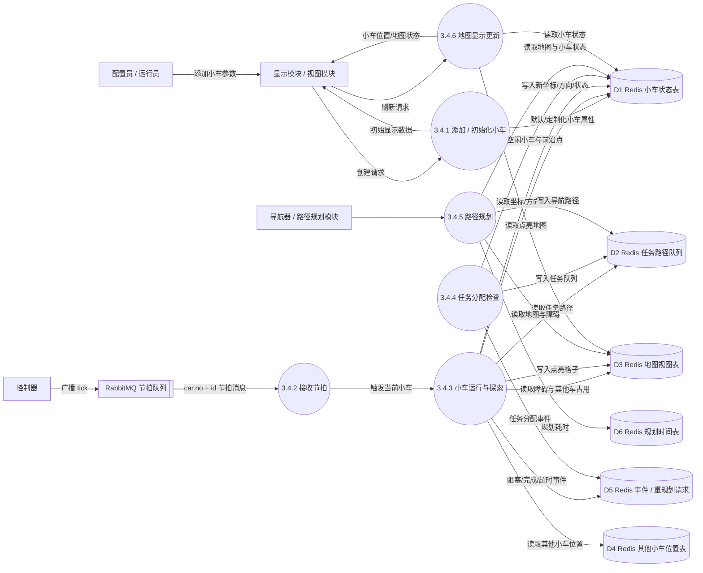
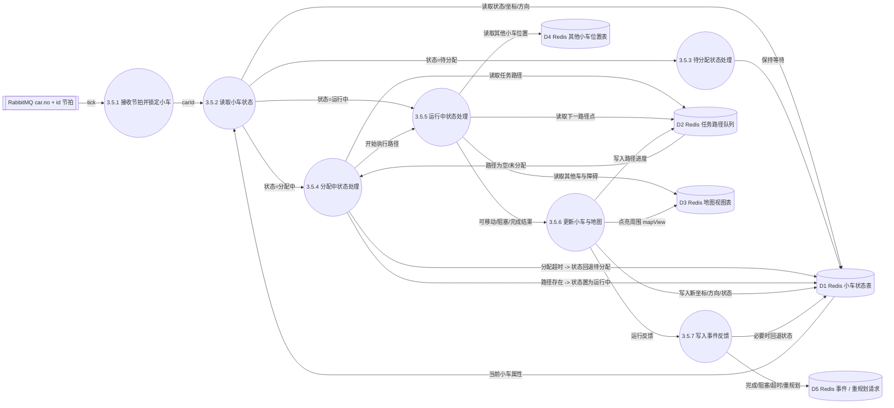
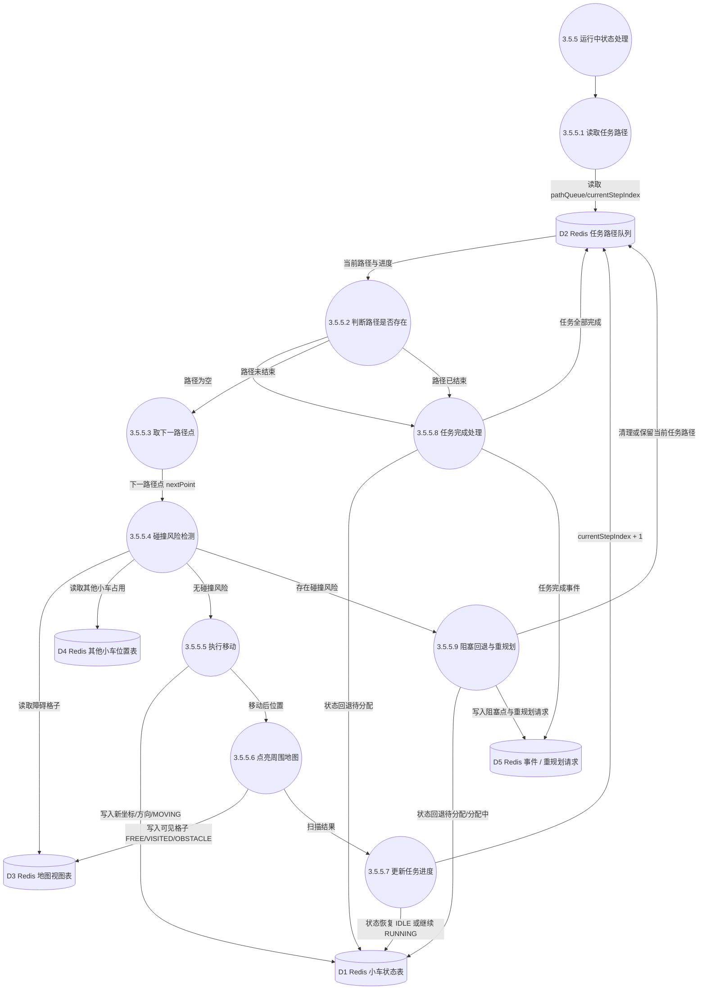
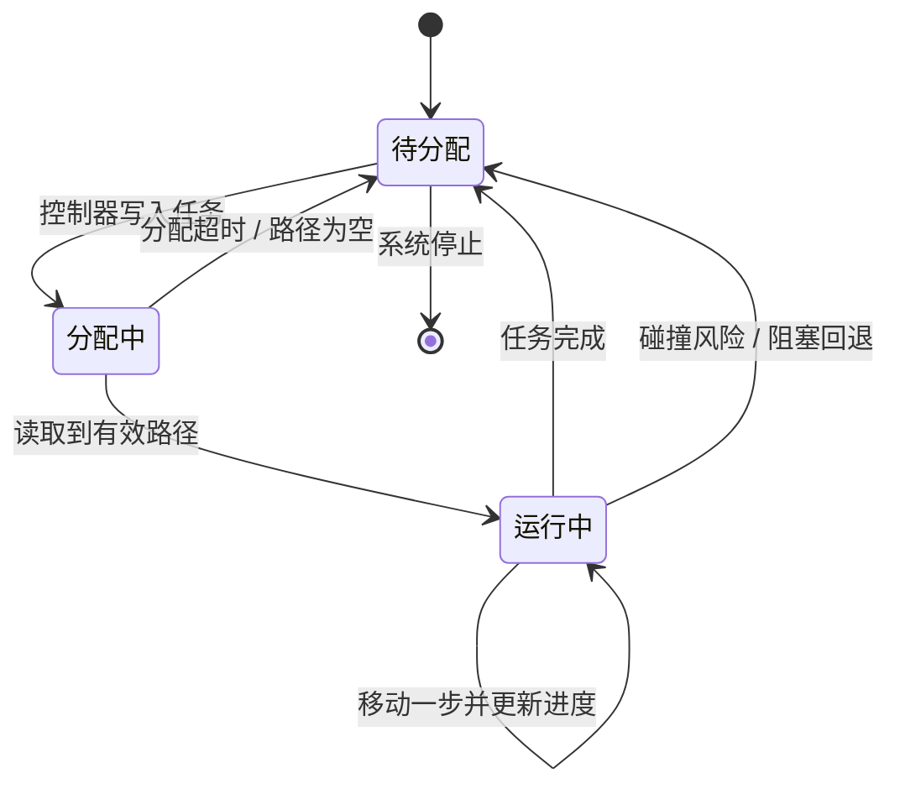
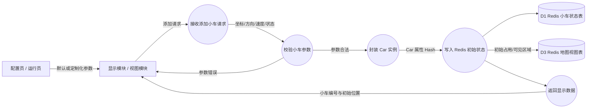
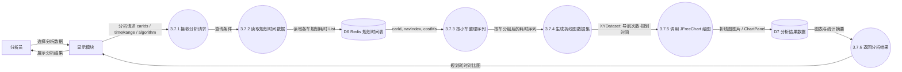

# 3.4 小车模块与数据分析模块细化数据流图设计

本文用于补充报告 `3.4 详细设计——模块描述` 中由本人负责的小车模块和数据分析模块。整体口径与《数据流图设计整理.md》保持一致：Redis 中的数据按“数据存储 / 逻辑表”处理；RabbitMQ 节拍、显示模块、控制器、导航器按外部实体或相邻加工处理；小车模块内部只描述自身加工，不直接调用其他模块。

建议在报告中使用以下图号：

| 图号 | 图名 | 作用 |
| --- | --- | --- |
| 图 3-4 | 地图探索子系统细化数据流图 | 从控制器节拍、任务分配、导航规划到小车探索的总体数据流 |
| 图 3-5 | 小车模块二层数据流图 | 展开小车收到节拍后的状态检查、任务读取、移动、扫描、回退 |
| 图 3-6 | 小车模块三层数据流图 | 进一步展开运行中状态的路径执行、碰撞检测、地图点亮与重规划反馈 |
| 图 3-7 | 数据分析模块细化数据流图 | 展开从 Redis 读取规划时间、整理序列、绘制折线图并返回显示模块 |

## 1. 图例与数据存储

### 1.1 外部实体

| 编号 | 外部实体 | 说明 |
| --- | --- | --- |
| E1 | 配置员 / 运行员 | 通过显示模块添加小车、启动探索、选择数据分析 |
| E2 | 显示模块 / 视图模块 | 调用 CarManager 创建小车，展示小车位置、点亮地图、分析图 |
| E3 | 控制器 | 广播 RabbitMQ 节拍，驱动小车每个节拍运行一步 |
| E4 | 导航器 / 路径规划模块 | 根据任务与地图生成路径，并将路径写入 Redis 任务队列 |
| E5 | 分析员 | 选择查看规划耗时分析结果 |

### 1.2 数据存储

| 编号 | 数据存储 | Redis 类型建议 | 主要数据 |
| --- | --- | --- | --- |
| D1 | Redis 小车状态表 | Hash | `carId`、坐标、方向、状态、终点、当前任务、当前路径下标 |
| D2 | Redis 小车任务路径队列 | List / Hash 字段 | 小车待执行的路径点序列、任务状态、分配时间、规划结果 |
| D3 | Redis 地图视图表 | Hash / Set | 已点亮格子、障碍格子、地图版本、mapView 更新记录 |
| D4 | Redis 其他小车位置表 | Hash | 其他小车的坐标、下一步目标点、占用格子 |
| D5 | Redis 系统事件 / 重规划请求 | Stream / Hash | 阻塞、分配超时、任务完成、请求重新规划等事件 |
| D6 | Redis 规划时间表 | List | 每辆小车或每次导航的规划耗时序列 |
| D7 | 分析结果数据 | 内存对象 / 图片缓存 | 折线图数据集、统计摘要、JFreeChart 图像 |

如果和已有完整 DFD 对齐，可以把 D1 对应为 `inspection:vehicles`，D2 对应为 `inspection:tasks` 与 `inspection:navigation_plans`，D3 对应为 `inspection:map:chunks`，D5 对应为 `inspection:events` 或 `inspection:navigation_requests`，D6 可并入回放/分析数据存储。

## 2. 图 3-4 地图探索子系统细化数据流图

这一层不要展开每个函数，只画地图探索子系统中各模块如何通过 RabbitMQ 和 Redis 交换数据。小车、控制器、导航器、显示器之间不画直接函数调用，重点突出“节拍消息”和“Redis 数据存储”。



### 2.1 图中主要数据流

| 数据流 | 内容 |
| --- | --- |
| 添加小车参数 | 小车数量、初始坐标、速度、方向、状态默认值 |
| 节拍消息 | 控制器广播的 tick，小车监听自己的 `car.no + id` 队列 |
| 小车状态 | 坐标、方向、状态、当前任务、当前路径下标 |
| 任务路径 | 路径点列表、终点、分配时间、任务状态 |
| 点亮地图 | 小车当前位置周围可见格子的状态更新 |
| 阻塞 / 重规划请求 | 碰撞风险位置、当前任务、回退后的状态 |
| 规划耗时 | 小车编号、导航次数、算法名称、耗时毫秒值 |

## 3. 图 3-5 小车模块二层数据流图

小车模块二层图的核心是“收到一个节拍后，小车按照自身状态分支处理”。状态建议画成三个主分支：待分配、分配中、运行中。这样能直接对应报告文字。



### 3.1 二层加工说明

| 编号 | 加工 | 输入 | 读取 / 写入 | 输出 |
| --- | --- | --- | --- | --- |
| P3.5.1 | 接收节拍并锁定小车 | RabbitMQ tick、carId | 无 | 当前小车本轮执行触发 |
| P3.5.2 | 读取小车状态 | carId | 读 D1 | 坐标、方向、状态、当前任务 |
| P3.5.3 | 待分配状态处理 | 状态=待分配 | 写 D1 心跳/状态时间 | 继续等待任务 |
| P3.5.4 | 分配中状态处理 | 状态=分配中 | 读 D2，写 D1/D5 | 有路径则进入运行中，无路径且超时则回退待分配 |
| P3.5.5 | 运行中状态处理 | 状态=运行中 | 读 D2/D3/D4 | 下一步移动结果或异常结果 |
| P3.5.6 | 更新小车与地图 | 移动结果 | 写 D1/D2/D3 | 新坐标、新方向、点亮地图、路径进度 |
| P3.5.7 | 写入事件反馈 | 完成、阻塞、超时 | 写 D5，必要时写 D1 | 完成事件、重规划事件、状态回退 |

## 4. 图 3-6 小车模块三层数据流图

三层图建议重点展开 `3.5.5 运行中状态处理`，因为这里最能体现小车模块的业务逻辑：取路径、判断是否还有任务、碰撞检测、移动、点亮地图、任务完成或重规划。



### 4.1 三层加工说明

| 编号 | 加工 | 判断规则 | 写入结果 |
| --- | --- | --- | --- |
| P3.5.5.1 | 读取任务路径 | 按 `carId` 读取任务队列或 `pathQueue` | 无 |
| P3.5.5.2 | 判断路径是否存在 | 分配中无路径为分配超时，运行中无路径为任务完成 | 超时或完成时写 D1/D5 |
| P3.5.5.3 | 取下一路径点 | 根据当前下标取 `nextPoint` | 无 |
| P3.5.5.4 | 碰撞风险检测 | 下一点为障碍、被其他小车占用、或与其他车下一步互换位置 | 阻塞时写 D5 |
| P3.5.5.5 | 执行移动 | 通过碰撞检测后更新坐标与方向 | 写 D1 |
| P3.5.5.6 | 点亮周围地图 | 以当前位置为中心，将感知半径内格子标记为可见 | 写 D3 |
| P3.5.5.7 | 更新任务进度 | 移动成功后路径下标加一 | 写 D2 |
| P3.5.5.8 | 任务完成处理 | 路径执行完或任务队列为空 | 写 D1/D2/D5 |
| P3.5.5.9 | 阻塞回退与重规划 | 有碰撞风险或真实障碍 | 写 D1/D2/D5 |

### 4.2 小车状态转换关系



## 5. CarManager 添加小车细化数据流

报告文字中提到“在显示器添加小车时，通过 CarManager 与视图模块协作，封装创建 Car 的实例”。这部分可以作为小车模块初始化的补充图，不必和运行时节拍图混在一起。



### 5.1 初始化数据流说明

| 数据流 | 内容 |
| --- | --- |
| 默认小车参数 | 默认坐标、方向、速度、状态、感知半径 |
| 定制化小车参数 | 用户指定的坐标、方向、编号或显示属性 |
| Car 属性 Hash | `id`、`x`、`y`、`direction`、`status`、`target` |
| 初始显示数据 | 小车编号、当前位置、方向、地图初始点亮区域 |

## 6. 图 3-7 数据分析模块细化数据流图

数据分析模块的输入来自显示模块的分析请求，核心数据来自 Redis 中每辆小车的路径规划耗时 List。该模块主要是读取、整理和绘图，不改变小车运行状态。



### 6.1 数据分析加工说明

| 编号 | 加工 | 输入 | 读取 / 写入 | 输出 |
| --- | --- | --- | --- | --- |
| P3.7.1 | 接收分析请求 | 分析员选择的小车、算法、时间范围 | 无 | 查询条件 |
| P3.7.2 | 读取规划时间数据 | 查询条件 | 读 D6 | 原始规划耗时列表 |
| P3.7.3 | 按小车整理序列 | `carId, navIndex, costMs` | 内存处理 | 每辆车一组折线数据 |
| P3.7.4 | 生成折线图数据集 | 分组后的耗时序列 | 内存处理 | JFreeChart 所需 `XYDataset` |
| P3.7.5 | 调用 JFreeChart 绘图 | `XYDataset`、标题、坐标轴名称 | 写 D7 或直接返回 | 折线图图片 / 图表面板 |
| P3.7.6 | 返回分析结果 | 图表与统计摘要 | 读 D7 | 显示模块可展示的数据 |

### 6.2 数据分析模块数据项

| 数据项 | 说明 |
| --- | --- |
| `carId` | 小车编号，用于区分不同折线 |
| `navIndex` | 第几次导航 / 第几次路径规划，作为横坐标 |
| `costMs` | 本次路径规划耗时，作为纵坐标 |
| `algorithm` | 路径规划算法名称，可用于图例或筛选 |
| `createdAt` | 规划完成时间，可用于时间范围筛选 |
| `avgCostMs` | 平均规划耗时，用于统计摘要 |
| `maxCostMs` | 最大规划耗时，用于发现异常规划 |

### 6.3 Redis 规划时间表建议结构

可以按“小车一个 List”存储：

```text
Key: car:{carId}:planTime
Type: List
Value: {"navIndex":1,"costMs":23,"algorithm":"A*","createdAt":1710000000000}
```

也可以按“全局一个 List”存储：

```text
Key: analysis:planTime
Type: List
Value: {"carId":"car-01","navIndex":1,"costMs":23,"algorithm":"A*","createdAt":1710000000000}
```

如果报告中要和完整数据流图统一命名，推荐写成：

```text
D6 Redis 规划时间表：保存每次路径规划耗时，逻辑上属于回放分析数据；数据分析模块只读该表并生成折线图。
```

## 7. 画图时可直接使用的节点清单

### 7.1 小车模块二层图节点

| 类型 | 节点 |
| --- | --- |
| 外部实体 | RabbitMQ 节拍队列 |
| 加工 | 接收节拍、读取小车状态、待分配状态处理、分配中状态处理、运行中状态处理、更新小车与地图、写入事件反馈 |
| 数据存储 | Redis 小车状态表、Redis 任务路径队列、Redis 地图视图表、Redis 其他小车位置表、Redis 事件 / 重规划请求 |

### 7.2 小车模块三层图节点

| 类型 | 节点 |
| --- | --- |
| 加工 | 读取任务路径、判断路径是否存在、取下一路径点、碰撞风险检测、执行移动、点亮周围地图、更新任务进度、任务完成处理、阻塞回退与重规划 |
| 数据存储 | Redis 小车状态表、Redis 任务路径队列、Redis 地图视图表、Redis 其他小车位置表、Redis 事件 / 重规划请求 |

### 7.3 数据分析模块节点

| 类型 | 节点 |
| --- | --- |
| 外部实体 | 分析员、显示模块 |
| 加工 | 接收分析请求、读取规划时间数据、按小车整理序列、生成折线图数据集、调用 JFreeChart 绘图、返回分析结果 |
| 数据存储 | Redis 规划时间表、分析结果数据 |

## 8. 报告文字可配套描述

小车模块的数据流以 RabbitMQ 节拍为触发源。小车收到属于自己的节拍后，首先从 Redis 小车状态表读取坐标、方向和状态，再按待分配、分配中、运行中三种状态分支处理。待分配状态只保持等待；分配中状态会读取任务路径队列，若超时仍无路径则回退为待分配，若存在路径则进入运行中；运行中状态读取下一路径点，结合地图障碍和其他小车位置进行碰撞风险检测，通过检测后更新自身坐标、方向和任务进度，并将周围地图格子点亮写回 Redis。若路径为空、任务完成或检测到碰撞风险，小车会写入事件或重规划请求，并回退状态等待下一次分配。

数据分析模块的数据流以显示模块的分析请求为触发源。模块根据用户选择的小车编号和时间范围读取 Redis 中的规划耗时 List，将数据按小车分组，生成以导航次数为横坐标、规划时间为纵坐标的折线图数据集，再调用 JFreeChart 绘制多车规划耗时对比图，最后把图表和平均耗时、最大耗时等统计摘要返回显示模块。该模块只读取运行过程中沉淀的规划耗时数据，不改变小车状态和任务队列。

