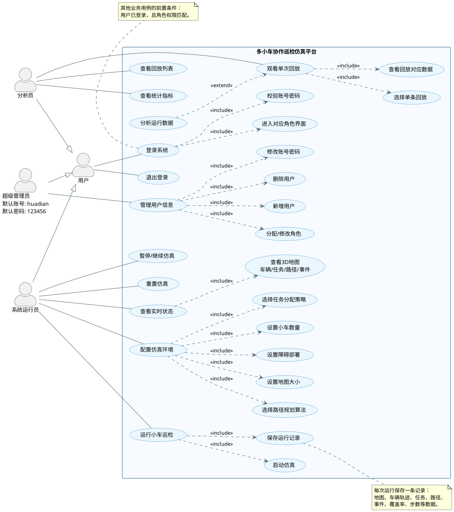

# 用户分级与回放功能用例图设计稿

## 1. 用例图设计目标

本用例图用于描述“多小车协作巡检仿真平台”在现有仿真系统基础上增加登录、用户分级、权限控制和回放查看后的用户目标。

重点表达：

- 进入系统前必须登录。
- 用户分为三级：超级管理员、系统运行员、分析员。
- 超级管理员负责管理系统运行员和分析员账号。
- 系统运行员负责配置仿真参数、运行系统、跑小车、查看实时状态。
- 分析员负责查看历史运行记录、观看每条回放，并查看每条回放对应的数据。
- 回放功能是新增重点：每次运行应保存一条运行记录，包含回放轨迹和对应数据。

注意：用例图不是流程图，不建议画“第一步、第二步、第三步”的详细顺序；它主要表达“谁能做什么”。登录顺序可以通过“登录系统”和“前置条件：已登录且权限匹配”说明。

## 2. 参与者设计

| 参与者 | 说明 |
| --- | --- |
| 用户 | 抽象父角色，表示所有需要登录的人 |
| 超级管理员 | 系统最高权限用户，默认账号 `huadian`，默认密码 `123456` |
| 系统运行员 | 负责配置并运行多小车巡检仿真 |
| 分析员 | 负责查看回放和分析运行数据 |

角色继承关系：

```text
超级管理员 -> 用户
系统运行员 -> 用户
分析员 -> 用户
```

## 3. 系统边界

系统边界建议命名：

```text
多小车协作巡检仿真平台
```

不要把 Redis、FastAPI、Controller、Navigator、Robot 画成外部参与者。它们属于系统内部实现，不是用例图中的 actor。

## 4. 用例分组

### 4.1 公共认证用例

| 用例 | 说明 |
| --- | --- |
| 登录系统 | 所有用户进入系统前都要登录 |
| 校验账号密码 | 登录必须包含的认证步骤 |
| 进入对应角色界面 | 登录成功后按角色进入不同界面 |
| 退出登录 | 用户退出系统 |

### 4.2 超级管理员用例

| 用例 | 说明 |
| --- | --- |
| 管理用户信息 | 管理系统运行员和分析员 |
| 新增用户 | 新建系统运行员或分析员账号 |
| 删除用户 | 删除系统运行员或分析员账号 |
| 修改账号密码 | 修改系统运行员或分析员的账号、密码 |
| 分配/修改角色 | 将用户设置为系统运行员或分析员 |

### 4.3 系统运行员用例

| 用例 | 说明 |
| --- | --- |
| 配置仿真环境 | 运行前配置地图、障碍、车辆和算法 |
| 设置地图大小 | 对应现有地图宽度、高度、分块配置 |
| 设置障碍部署 | 对应随机障碍、手动障碍部署 |
| 设置小车数量 | 对应车辆随机部署 |
| 选择任务分配策略 | 对应 `nearest`、`greedy`、`low_mdp` |
| 选择路径规划算法 | 对应 `baseline`、`cbs` |
| 运行小车巡检 | 启动系统并让小车执行探索 |
| 启动仿真 | 开始运行 |
| 暂停/继续仿真 | 暂停或恢复运行 |
| 重置仿真 | 重置系统状态 |
| 查看实时状态 | 查看 3D 地图、车辆、任务、路径和事件 |
| 保存运行记录 | 每次运行产生回放和数据记录，为分析员回放提供数据 |

### 4.4 分析员用例

| 用例 | 说明 |
| --- | --- |
| 查看回放列表 | 查看所有历史运行记录 |
| 选择单条回放 | 从历史记录中选择一次运行 |
| 观看单次回放 | 回放某一次巡检过程 |
| 查看回放对应数据 | 每条回放都要能查看对应的数据 |
| 查看统计指标 | 查看覆盖率、行走步数、任务数、路径规划结果等 |
| 分析运行数据 | 可选功能，可以先不实现为复杂分析，只保留用例表示扩展方向 |

## 5. 回放记录建议包含的数据

为了满足“每条回放都要有对应的数据”，建议每次运行保存一条 `RunRecord`，至少包含：

| 数据项 | 说明 |
| --- | --- |
| runId | 本次运行编号 |
| createdAt | 运行开始或保存时间 |
| operator | 运行员账号 |
| mapConfig | 地图宽度、高度、分块大小 |
| obstacleConfig | 障碍数量、障碍模式 |
| vehicleCount | 小车数量 |
| policy | 任务分配策略 |
| navigatorAlgorithm | 路径规划算法 |
| snapshots | 按时间保存的地图、车辆、frontier、task、plan 快照 |
| events | 系统事件列表 |
| metrics | 覆盖率、行走步数、任务数量、导航请求数量、成功/失败路径数 |

图里不需要展开这些字段，只需要保留“保存运行记录”“观看单次回放”“查看回放对应数据”三个用例。

## 6. ConceptViz 直接粘贴版

可以把下面这段直接粘贴到 ConceptViz 的创建框中，让它生成 UML 用例图：

```text
创建一个 UML 用例图，系统边界命名为“多小车协作巡检仿真平台”。

参与者：
1. 用户：抽象父角色，所有人都需要登录。
2. 超级管理员：继承用户，默认账号为 huadian，默认密码为 123456，负责管理另外两级用户。
3. 系统运行员：继承用户，负责配置仿真环境并运行多小车巡检。
4. 分析员：继承用户，负责查看历史运行回放和对应数据。

公共用例：
- 登录系统
- 校验账号密码
- 进入对应角色界面
- 退出登录

超级管理员用例：
- 管理用户信息
- 新增用户
- 删除用户
- 修改账号密码
- 分配/修改角色

系统运行员用例：
- 配置仿真环境
- 设置地图大小
- 设置障碍部署
- 设置小车数量
- 选择任务分配策略
- 选择路径规划算法
- 运行小车巡检
- 启动仿真
- 暂停/继续仿真
- 重置仿真
- 查看实时状态
- 保存运行记录

分析员用例：
- 查看回放列表
- 选择单条回放
- 观看单次回放
- 查看回放对应数据
- 查看统计指标
- 分析运行数据

关系：
- 超级管理员、系统运行员、分析员都继承“用户”。
- 用户关联“登录系统”和“退出登录”。
- “登录系统”包含“校验账号密码”和“进入对应角色界面”。
- 超级管理员关联“管理用户信息”。
- “管理用户信息”包含“新增用户”“删除用户”“修改账号密码”“分配/修改角色”。
- 系统运行员关联“配置仿真环境”“运行小车巡检”“暂停/继续仿真”“重置仿真”“查看实时状态”。
- “配置仿真环境”包含“设置地图大小”“设置障碍部署”“设置小车数量”“选择任务分配策略”“选择路径规划算法”。
- “运行小车巡检”包含“启动仿真”和“保存运行记录”。
- “查看实时状态”包含“查看 3D 地图、车辆、任务、路径和事件”。
- 分析员关联“查看回放列表”“观看单次回放”“查看统计指标”。
- “观看单次回放”包含“选择单条回放”和“查看回放对应数据”。
- “分析运行数据”扩展“观看单次回放”，表示分析功能可以作为后续可选扩展。

请保持角色在系统边界外，用例在系统边界内；使用从左到右布局；不要把 Redis、FastAPI、Controller、Navigator、Robot 画成参与者，因为它们是系统内部组件。
```

## 7. PlantUML 代码版

如果 ConceptViz 使用 PlantUML 输入，或你想在其他 UML 工具中生成图，可以复制下面代码：



## 8. 图形布局建议

建议最终图按左右结构排版：

- 左侧上方：超级管理员。
- 左侧中间：用户。
- 左侧下方：系统运行员。
- 右侧下方：分析员。
- 中间大矩形：多小车协作巡检仿真平台。
- 矩形内部从左到右分四组：认证与权限、用户管理、仿真运行、回放分析。

如果图太拥挤，可以拆成两张：

1. 权限总览用例图：登录、三类用户、用户管理、仿真运行、回放分析。
2. 回放功能细化用例图：查看回放列表、选择单条回放、播放/暂停/拖动回放、查看回放数据、查看统计指标。

## 9. 答辩说明可用文本

```text
本系统在原有多小车协作巡检仿真功能基础上增加用户登录与分级权限管理。所有用户进入系统前必须登录，登录成功后根据角色进入不同界面。超级管理员使用默认账号 huadian、密码 123456 登录，负责新增、删除、修改系统运行员和分析员账号，并分配角色。系统运行员负责配置地图大小、障碍、小车数量、任务分配策略和路径规划算法，并启动、暂停、重置仿真，运行多小车巡检。分析员不负责运行系统，而是查看每次运行保存的回放记录，观看单条回放，并查看该回放对应的地图、车辆轨迹、任务、路径、事件和统计指标数据。
```
