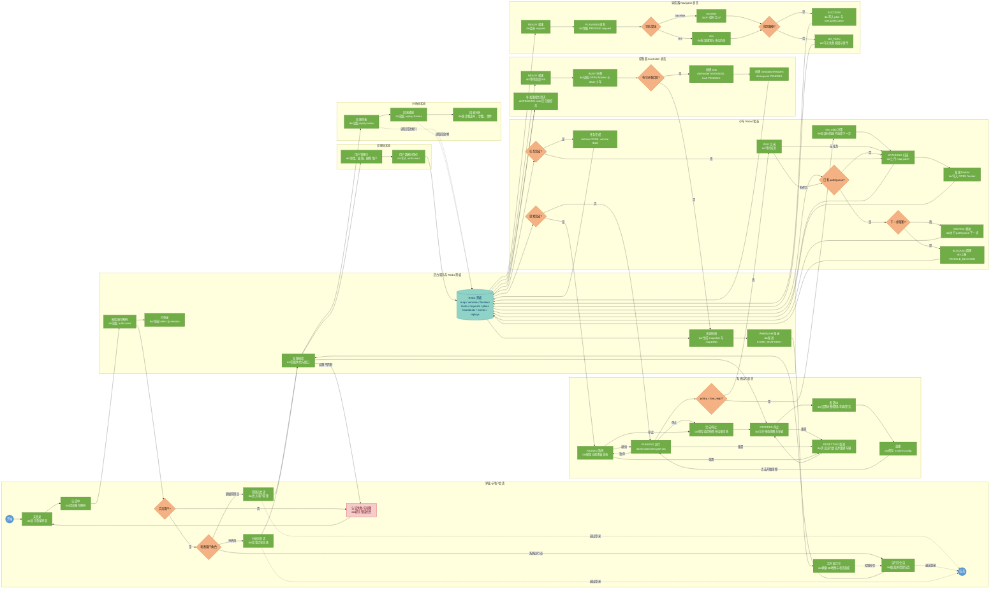

# 多小车协作巡检仿真系统状态图设计稿

## 1. 图的定位

这张图参考给定示例中的“状态块 + do/动作说明 + 判断节点”画法，重点表达本项目从用户登录、角色分流，到系统运行、组件协作、状态反馈的完整状态迁移。

图中不展开具体代码函数和算法公式，只保留答辩时最需要说明的状态变化：

- 用户会话状态：未登录、认证中、管理员会话、运行员会话、分析员会话、认证失败或无权限。
- 系统运行状态：`STOPPED`、配置中、就绪、`RUNNING`、`PAUSED`、重置、完成或停止。
- 小车状态：`IDLE`、`SCANNING`、`MOVING`、`BLOCKED`。
- 任务状态：`PENDING`、`PLANNED`、`RUNNING`、`DONE`、`FAILED`。
- 导航状态：`PENDING`、`PLANNING`、`SUCCESS`、`NO_PATH`。
- 数据反馈状态：Redis 黑板保存共享状态，WebSocket 推送快照，前端实时刷新。

## 2. Mermaid 状态图

下面的 Mermaid 可以直接复制到支持 Mermaid 的 Markdown 编辑器中预览，也可以作为 draw.io、ProcessOn、Visio 或 PPT 重绘时的结构底稿。



## 3. 状态转移说明

| 状态范围 | 关键状态 | 触发条件 | 迁移结果 |
| --- | --- | --- | --- |
| 用户登录 | 未登录、认证中、已登录、错误 | 输入账号密码并调用 `/auth/login` | 成功后按角色进入管理员、运行员或分析员界面；失败返回登录界面 |
| 权限控制 | 权限校验 | 访问 `/admin/*`、`/runtime/*`、`/control/*`、`/state`、`/ws`、`/replays` | 角色匹配则继续；不匹配进入无权限提示 |
| 系统运行 | `STOPPED`、配置中、就绪、`RUNNING`、`PAUSED` | 配置地图、车辆、策略、导航器数量后点击开始 | `RUNNING` 后进入调度 tick；暂停保留黑板状态；停止保存最后快照 |
| 小车执行 | `IDLE`、`SCANNING`、`MOVING`、`BLOCKED` | Robot 每个 tick 读取任务和路径 | 无任务则扫描并发现 frontier；有路径则移动；遇障碍则上报重规划 |
| 控制器分配 | `READY`、`BUSY` | Controller 读取 OPEN frontier 和 IDLE 小车 | 有目标则创建 task 与 navigationRequest；无目标则等待下一轮 |
| 导航规划 | `PENDING`、`PLANNING`、`SUCCESS`、`NO_PATH` | Navigator 领取 navigationRequest | baseline 使用 A* 或时空 A*；cbs 批量规划；成功写入 pathQueue，失败写入原因 |
| 回放分析 | 回放列表、回放播放、回放分析 | 分析员选择历史回放 | 读取 replay index 和 replay frames，展示历史状态与统计指标 |

## 4. 图中建议保留的节点文字

### 界面

```text
未登录
认证中
判断用户角色
管理员会话
运行员会话
分析员会话
实时展示中
认证失败/无权限
```

### 后台服务与 Redis 黑板

```text
校验账号密码
生成 token 与 session
权限校验
Redis 黑板
状态快照
WebSocket 推送
```

### 系统运行状态

```text
STOPPED
配置中
就绪
RUNNING
PAUSED
RESETTING
完成/停止
```

### Robot / Controller / Navigator

```text
IDLE 空闲
SCANNING 扫描
MOVING 移动
BLOCKED 阻塞
创建 task
创建 navigationRequest
PLANNING 规划
SUCCESS
NO_PATH
```

## 5. 正式绘图样式建议

| 元素 | 形状 | 建议颜色 | 说明 |
| --- | --- | --- | --- |
| 开始/结束 | 圆形或双圆形 | 蓝色 `#5B9BD5` | 对应参考图的起止状态 |
| 普通状态 | 圆角矩形 | 绿色 `#70AD47` | 状态名放第一行，`do/动作` 放第二行 |
| 判断条件 | 菱形 | 橙色 `#F4B183` | 如“合法用户？”“policy = low_mdp？”“找到路径？” |
| Redis 黑板 | 数据库圆柱或数据块 | 青绿色 `#8FD3C7` | 突出共享状态中心 |
| 错误/无权限 | 圆角矩形 | 浅红 `#F4CCCC` | 表示登录失败或权限不足 |
| 反馈/快照 | 虚线箭头 | 蓝色虚线 | 表示 WebSocket 快照回流到界面 |

## 6. 答辩讲解词

```text
这张状态图从用户登录开始。用户输入账号密码后，后台读取 Redis 中的 auth users 校验身份，登录成功后生成 token 和 session，并根据角色进入不同状态。超级管理员进入用户管理状态，分析员进入回放分析状态，系统运行员进入仿真配置和运行状态。

运行员配置地图、障碍、车辆数量、任务分配策略和导航算法后点击开始，系统状态从 STOPPED 进入 RUNNING。运行中 SimulationEngine 每个 tick 调度 Robot、Controller 和 Navigator。Robot 在 IDLE 时扫描地图并上传 map patch，发现 frontier 后写入 Redis 黑板；Controller 读取 OPEN frontier 和空闲小车，创建 task 和 navigationRequest；Navigator 领取请求后使用 baseline 或 CBS 规划路径，成功则写入 SUCCESS plan 和 task.pathQueue，失败则写入 NO_PATH。

小车读取 pathQueue 后进入 MOVING 状态，若下一步被障碍阻塞则进入 BLOCKED 并请求重规划；若路径执行完成，则任务变为 DONE，车辆回到 IDLE。Redis 黑板持续保存 map、vehicles、frontiers、tasks、requests、plans、events 和 replays，后台生成状态快照并通过 WebSocket 推送给前端，所以界面可以实时刷新 3D 地图和状态面板。
```
