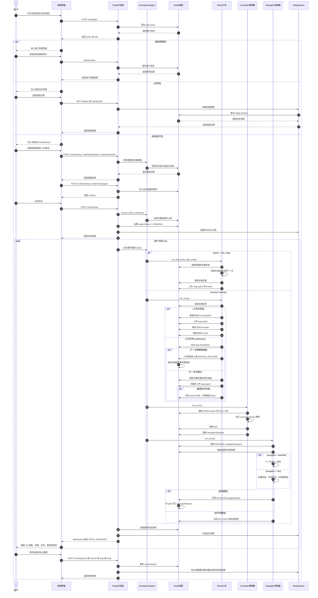

# 多小车协作巡检仿真系统顺序图展示内容

## 1. 顺序图要表达什么

这张顺序图建议命名为：

```text
多小车协作巡检仿真系统核心交互顺序图
```

图的重点不是把每一个函数都画出来，而是说明一次完整实验运行中，各对象如何按时间顺序协作：

```text
用户登录 -> 前端配置仿真 -> 后端写入运行配置 -> Redis 黑板保存状态
-> Robot 扫描和执行 -> Controller 分配任务 -> Navigator 规划路径
-> Redis 黑板回写结果 -> 前端通过 WebSocket 实时展示
```

如果参考学长学姐的顺序图，你的图中可以把上方生命线设计为：

| 参考图对象 | 本实验建议对象 | 说明 |
| --- | --- | --- |
| UI | 用户 | 超级管理员、系统运行员、分析员，图中主流程以系统运行员为主 |
| View | 前端界面 | Dashboard、登录页、回放页，负责发请求和展示状态 |
| Controller | FastAPI 后端 / SimulationEngine | 接收接口请求，校验权限，启动 tick 调度 |
| Car | Robot 小车 | 执行路径、扫描地图、上传地图 patch、发现 frontier |
| Navigator | Navigator 导航器 | 领取导航请求，执行 A*、时空 A* 或 CBS |
| Redis | Redis 黑板 | 保存 map、vehicles、frontiers、tasks、navigationRequests、navigationPlans、events |
| DB | 回放/用户数据 | 项目中主要也保存在 Redis，可在图中写成 Auth/Replays 或 Redis 持久数据 |

为了画面清楚，推荐画 7 条生命线：

```text
用户 / 前端界面 / FastAPI后端 / Redis黑板 / Robot小车 / Controller控制器 / Navigator导航器
```

如果还要展示用户分级和回放，可以再增加：

```text
AuthStore / ReplayStore
```

但最终大图不要太挤，答辩主图优先展示“系统运行员运行仿真”的核心闭环。

## 2. 实验内容怎么描述

可以在报告或答辩中这样描述本实验：

```text
本实验实现了一个多小车协作巡检仿真平台。系统前端提供登录、地图配置、障碍部署、小车数量设置、任务分配策略选择、路径规划算法选择、启动暂停重置和 3D 可视化展示功能。后端采用 FastAPI 提供 REST 接口和 WebSocket 状态推送，使用 Redis 黑板保存地图、小车、frontier、任务、导航请求、路径计划、心跳、事件和回放数据。

系统运行时，Robot 小车负责扫描局部地图、上传地图 patch、发现 frontier 并执行路径；Controller 控制器读取开放 frontier 和空闲小车，根据 nearest 或 greedy 策略创建任务和导航请求；Navigator 导航器领取导航请求，使用 baseline、A*、时空 A* 或 CBS 生成路径计划，并写回 Redis 黑板。前端通过 WebSocket 接收状态快照，实时显示地图覆盖率、小车位置、任务、路径、frontier 和事件日志。

整个系统的核心特点是组件之间不直接互相调用，而是通过 Redis 黑板读写共享状态，从而降低 Robot、Controller、Navigator 之间的耦合，并为后续分布式 worker 部署提供扩展基础。
```

## 3. 顺序图主线

建议顺序图按时间从上到下分成 5 段。

### 3.1 登录与角色校验

这一段放在图最上方，用来说明系统不是直接进入仿真，而是先进行登录和权限判断。

| 顺序 | 消息 |
| --- | --- |
| 1 | 用户打开前端页面 |
| 2 | 前端显示登录界面 |
| 3 | 用户输入账号密码 |
| 4 | 前端调用 `/auth/login` |
| 5 | FastAPI 调用 AuthStore 校验账号密码 |
| 6 | AuthStore 从 Redis 读取用户信息 |
| 7 | 登录成功后返回 token 和 role |
| 8 | 前端根据 role 进入对应界面 |

角色分支可以这样写：

```text
超级管理员 -> 进入用户管理界面
系统运行员 -> 进入仿真运行 Dashboard
分析员 -> 进入历史回放界面
```

如果主图空间不够，登录部分可以简化为：

```text
登录认证成功，系统运行员进入 Dashboard
```

### 3.2 仿真配置与启动

这一段是系统运行员的开始流程。

| 顺序 | 消息 |
| --- | --- |
| 1 | 系统运行员配置地图大小、障碍数量、小车数量 |
| 2 | 前端调用 `/runtime/map`、`/runtime/obstacles`、`/runtime/vehicles` |
| 3 | FastAPI 判断系统是否处于 RUNNING 或 PAUSED |
| 4 | 若未运行，则调用 SimulationEngine 修改地图、障碍和车辆部署 |
| 5 | SimulationEngine 清空旧运行状态，初始化车辆 |
| 6 | Redis 黑板保存 map、vehicles、heartbeats、events |
| 7 | 前端选择任务分配策略和路径规划算法 |
| 8 | 前端调用 `/runtime/policy` 和 `/runtime/navigator` |
| 9 | FastAPI 写入运行配置 |
| 10 | 用户点击启动，前端调用 `/control/start` |
| 11 | FastAPI 设置 `systemStatus = RUNNING` |
| 12 | ReplayStore 创建本次运行记录 |
| 13 | WebSocket 开始推送状态快照 |

图中建议标注一个判断：

```text
系统正在运行？
是 -> 拒绝修改配置
否 -> 写入配置并初始化状态
```

### 3.3 普通协作巡检主循环

这是顺序图最核心的一段，建议用一个大 `loop 每个 tick` 框起来。

每个 tick 中，`SimulationEngine` 的调度顺序是：

```text
Robot 阶段 -> Controller 阶段 -> Navigator 阶段
```

#### Robot 阶段

| 顺序 | 消息 |
| --- | --- |
| 1 | SimulationEngine 调用 Robot.run_once() |
| 2 | Robot 从 Redis 黑板读取车辆列表和当前任务 |
| 3 | 如果车辆没有任务，Robot 进入扫描状态 |
| 4 | Robot 扫描局部地图 |
| 5 | Robot 上传 map patch |
| 6 | Redis 黑板合并 map patch，更新 mapVersion 和 mapDelta |
| 7 | Robot 检测 frontier |
| 8 | Redis 黑板保存 OPEN frontier |

如果车辆已有任务：

| 顺序 | 消息 |
| --- | --- |
| 1 | Robot 读取 task.pathQueue |
| 2 | 判断下一步是否被真实障碍阻塞 |
| 3 | 未阻塞则移动到下一格 |
| 4 | 更新车辆位置、电量、状态和任务进度 |
| 5 | 移动后再次扫描并上传地图 |
| 6 | 如果路径走完，则标记 task DONE，车辆回到 IDLE |
| 7 | 如果被阻塞，则上报 VEHICLE_BLOCKED，清空旧路径并请求重规划 |

#### Controller 阶段

| 顺序 | 消息 |
| --- | --- |
| 1 | SimulationEngine 调用 Controller.run_once() |
| 2 | Controller 写入心跳状态 BUSY |
| 3 | Controller 读取 OPEN frontier |
| 4 | Controller 读取 IDLE 小车 |
| 5 | Controller 执行任务分配策略 |
| 6 | nearest 策略选择最近可达 frontier |
| 7 | greedy 策略综合未知区域收益和路径距离 |
| 8 | Controller 创建 task |
| 9 | Controller 创建 navigationRequest |
| 10 | Redis 黑板保存 tasks 和 navigationRequests |
| 11 | Controller 心跳恢复 READY |

#### Navigator 阶段

| 顺序 | 消息 |
| --- | --- |
| 1 | SimulationEngine 调用 Navigator.run_once() |
| 2 | Navigator 从 Redis 黑板领取 PENDING navigationRequest |
| 3 | Navigator 读取地图、车辆和任务状态快照 |
| 4 | 判断路径规划算法 |
| 5 | baseline 模式使用 A* 或时空 A* |
| 6 | cbs 模式批量领取请求，检测路径冲突并加约束重规划 |
| 7 | 找到路径则生成 SUCCESS navigationPlan |
| 8 | 找不到路径则生成 NO_PATH navigationPlan |
| 9 | Redis 黑板保存 navigationPlans，并把 path 写入 task.pathQueue |

### 3.4 前端实时展示

这一段从 Redis 黑板回到前端，用来说明界面为什么能实时变化。

| 顺序 | 消息 |
| --- | --- |
| 1 | Redis 黑板保存最新 map、vehicles、frontiers、tasks、plans、events |
| 2 | FastAPI 的 broadcast_loop 周期性读取状态快照 |
| 3 | FastAPI 通过 `/ws` 发送 `STATE_SNAPSHOT` |
| 4 | 前端合并 mapDelta |
| 5 | 前端刷新 3D 地图、小车模型、frontier、路径和事件面板 |
| 6 | 前端更新覆盖率、步数、任务数、导航请求数等指标 |

图中这条可以画成一条从 `Redis黑板 -> FastAPI后端 -> 前端界面` 的回流消息：

```text
生成状态快照 / WebSocket 推送 / 刷新 3D Dashboard
```

### 3.5 暂停、继续、停止、重置和回放

运行控制可以作为主图底部的补充流程。

| 操作 | 顺序图消息 |
| --- | --- |
| 暂停 | 前端调用 `/control/pause`，FastAPI 写入 `systemStatus = PAUSED` |
| 继续 | 前端调用 `/control/resume`，FastAPI 写入 `systemStatus = RUNNING` |
| 停止 | 前端调用 `/control/stop`，FastAPI 写入 `STOPPED`，ReplayStore 保存最后快照并结束回放 |
| 重置 | 前端调用 `/control/reset`，ReplayStore 结束回放，SimulationEngine 清零 tick 和 movementSteps |
| 查看回放 | 分析员调用 `/replays` 和 `/replays/{id}`，ReplayStore 从 Redis 读取历史快照 |

## 4. `low_mdp` 特殊分支怎么画

`low_mdp` 是本项目的特殊策略。它和普通流程不同，应该在图中用一个 `alt policy = low_mdp` 分支表示。

普通模式：

```text
Robot 扫描 -> Controller 分配任务 -> Navigator 规划路径 -> Robot 执行路径
```

`low_mdp` 模式：

```text
Robot 读取地图和车辆状态 -> 局部 MDP 选择下一步 -> Robot 移动或等待 -> 扫描并上传地图
```

也就是说：

```text
low_mdp 模式下跳过 Controller 和 Navigator 的全局任务分配与路径规划。
```

图中可以写成：

```text
alt policy = low_mdp
  Robot 局部价值迭代选择下一步
  Robot 更新位置并上传 map patch
else nearest / greedy
  Controller 创建 task 和 request
  Navigator 规划 path
end
```

## 5. 图中建议保留的生命线

主图建议保留这些生命线：

```text
用户
前端界面
FastAPI后端
Redis黑板
SimulationEngine
Robot小车
Controller控制器
Navigator导航器
ReplayStore
```

如果图太宽，可以合并：

| 合并方式 | 说明 |
| --- | --- |
| FastAPI后端 + SimulationEngine | 合并成“后端服务/调度器” |
| Redis黑板 + ReplayStore | 合并成“Redis 黑板/回放数据” |
| 用户 + 前端界面 | 不建议合并，顺序图里最好保留用户发起操作 |

最终推荐版本：

```text
用户 / 前端界面 / 后端服务与调度器 / Redis黑板 / Robot小车 / Controller控制器 / Navigator导航器
```

## 6. 图中建议保留的消息文字

不要把接口和函数写得太密。图上每条消息尽量短一些。

| 类别 | 推荐消息文字 |
| --- | --- |
| 登录 | 输入账号密码、提交登录、校验用户、返回 token 和角色 |
| 配置 | 配置地图/障碍/车辆、选择策略和算法、写入运行配置 |
| 启动 | 点击启动、设置 RUNNING、创建回放记录、进入 tick 循环 |
| Robot | 读取任务、扫描地图、上传 map patch、发现 frontier、执行 pathQueue、上报阻塞、完成任务 |
| Controller | 读取 OPEN frontier、读取 IDLE 小车、执行 nearest/greedy、创建 task、创建 request |
| Navigator | 领取 request、读取地图快照、选择 baseline/cbs、规划路径、写回 plan |
| Redis | 保存 mapDelta、保存 vehicles、保存 frontiers、保存 tasks、保存 navigationPlans、记录 events |
| 前端展示 | WebSocket 快照、合并 mapDelta、刷新 3D 地图和状态面板 |
| 回放 | 记录运行快照、结束回放、查询回放列表、读取回放数据 |

## 7. Mermaid 顺序图草稿

下面这段可以直接复制到支持 Mermaid 的 Markdown 编辑器中预览。它不是最终美术图，但可以作为你画正式顺序图的内容模板。



## 8. 正式画图时的布局建议

### 8.1 画布

参考图是横向长图，你也建议使用横向画布：

```text
宽屏 16:9 或更宽，顶部放对象生命线，消息从上到下展开。
```

如果内容太多，可以拆成两张：

1. 登录、角色分流与回放顺序图。
2. 系统运行员启动仿真与多车协作巡检顺序图。

答辩主图建议用第 2 张，因为它最能体现 Robot、Controller、Navigator 和 Redis 黑板的协作。

### 8.2 生命线顺序

从左到右建议这样排：

```text
用户 -> 前端界面 -> FastAPI后端 -> SimulationEngine -> Redis黑板 -> Robot小车 -> Controller控制器 -> Navigator导航器 -> ReplayStore
```

如果想更像参考图，也可以排成：

```text
用户 -> 前端界面 -> FastAPI后端 -> Robot小车 -> Controller控制器 -> Navigator导航器 -> Redis黑板 -> ReplayStore
```

但为了突出黑板架构，推荐把 Redis 黑板放在中间或靠中间位置。

### 8.3 颜色建议

| 元素 | 建议颜色 |
| --- | --- |
| 生命线标题 | 蓝色 |
| 激活条 | 绿色 |
| 普通请求 | 绿色实线 |
| 返回消息 | 绿色虚线 |
| 判断框 alt/loop | 橙色或浅黄色边框 |
| 异常/重规划 | 红色或粉色箭头 |
| Redis 黑板 | 青绿色或数据库图标 |

### 8.4 图中不要写太细

顺序图中不建议放这些内容：

```text
完整代码函数体
A* 具体公式
CBS 低层约束细节
Three.js 贴图和模型路径
Redis key 的完整前缀
所有测试文件
```

这些可以放在报告正文或答辩说明里。顺序图只保留“谁调用谁、什么时候读写黑板、结果如何返回”。

## 9. 答辩时配合顺序图的讲解词

可以照下面这段讲：

```text
这张顺序图展示的是系统从登录到运行仿真的完整交互过程。用户先通过前端登录，后端校验账号密码并返回角色。系统运行员进入 Dashboard 后配置地图、障碍、小车数量、任务分配策略和路径规划算法，然后点击启动。FastAPI 后端接收启动命令，把系统状态写成 RUNNING，并创建本次回放记录。

进入运行状态后，SimulationEngine 每个 tick 按照 Robot、Controller、Navigator 的顺序调度。Robot 小车先读取任务，如果没有任务就扫描地图、上传 map patch 并发现 frontier；Controller 从 Redis 黑板读取开放 frontier 和空闲小车，根据 nearest 或 greedy 策略创建任务和导航请求；Navigator 领取导航请求，使用 baseline、A*、时空 A* 或 CBS 规划路径，并把 navigationPlan 写回 Redis 黑板。下一轮 tick 中，小车读取 pathQueue 并执行移动。

前端并不直接控制小车，而是通过 FastAPI 和 WebSocket 与后端交互。Redis 黑板保存 map、vehicles、frontiers、tasks、navigationRequests、navigationPlans、events 和 replay frames。FastAPI 周期性生成状态快照并通过 WebSocket 推送给前端，所以界面可以实时显示地图覆盖、小车位置、任务、路径和事件。这个设计体现了黑板架构的低耦合特点，也方便后续扩展成分布式 worker。
```

## 10. 最终检查清单

画完顺序图后检查下面几点：

- 是否有用户、前端、后端、Redis 黑板、Robot、Controller、Navigator。
- 是否体现登录和角色校验。
- 是否体现系统运行员配置地图、障碍、小车和算法。
- 是否体现 `/control/start` 后系统状态变为 RUNNING。
- 是否用 loop 表示每个仿真 tick。
- 是否体现 Robot 扫描地图、上传 map patch、发现 frontier。
- 是否体现 Controller 读取 frontier 和空闲小车，并创建 task 和 navigationRequest。
- 是否体现 Navigator 领取 request、规划路径、写回 navigationPlan。
- 是否体现 Redis 黑板保存共享状态。
- 是否体现 WebSocket 快照回到前端实时刷新。
- 是否体现暂停、继续、停止、重置和回放保存。
- 是否避免把算法公式和代码细节塞进图中。

